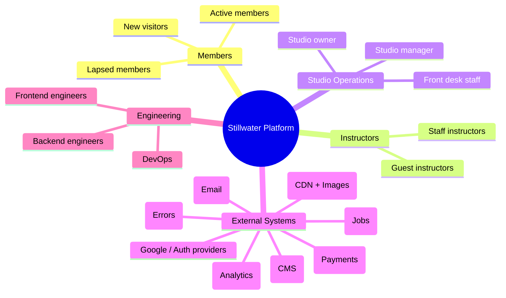
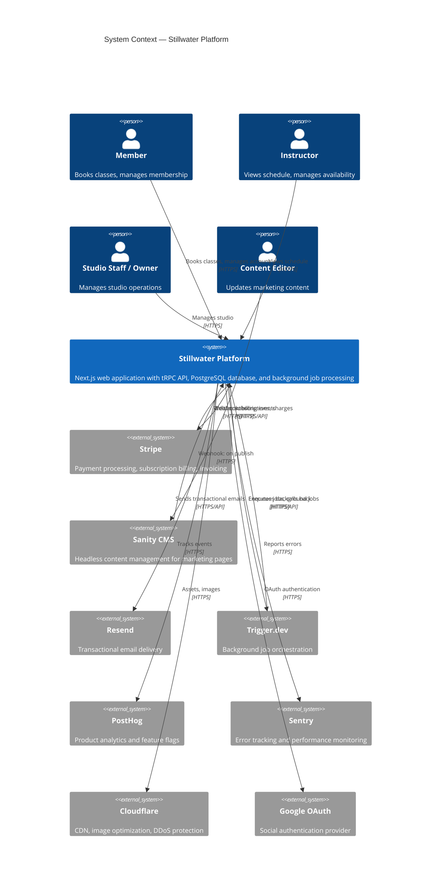
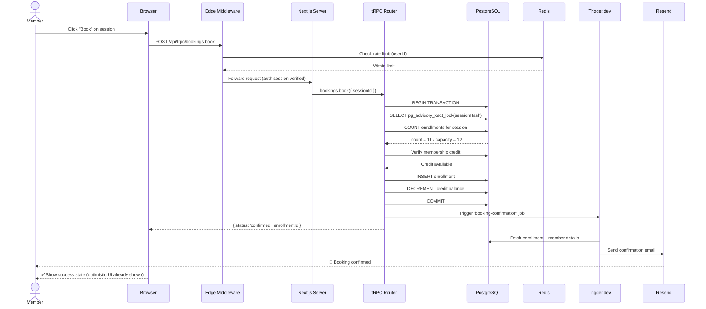
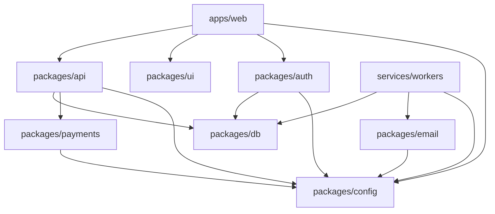
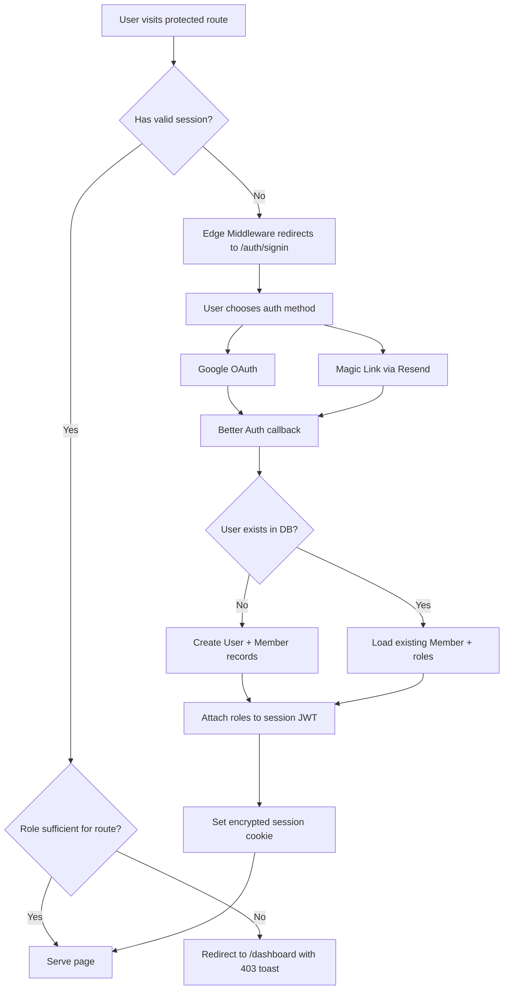
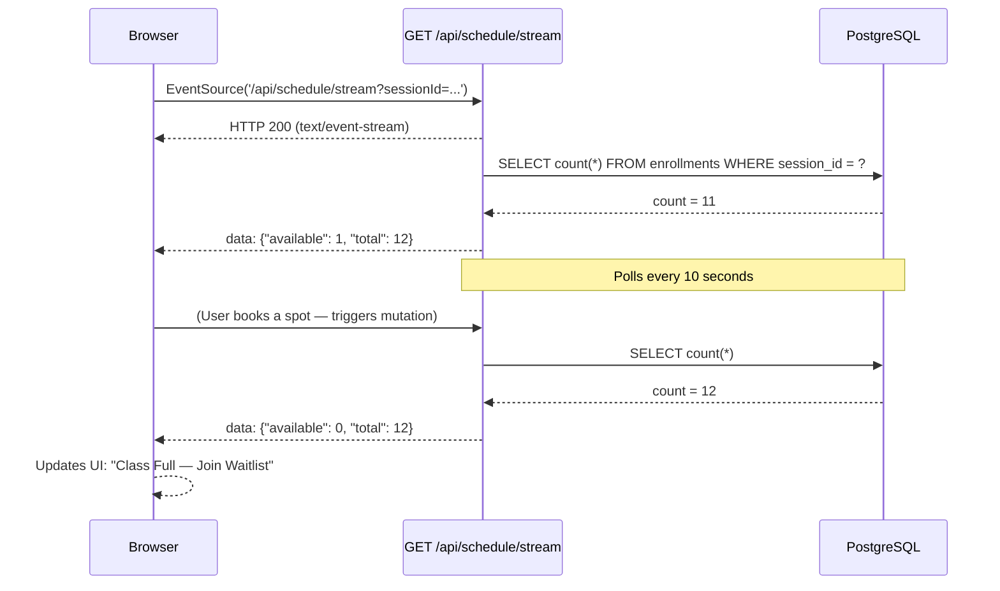
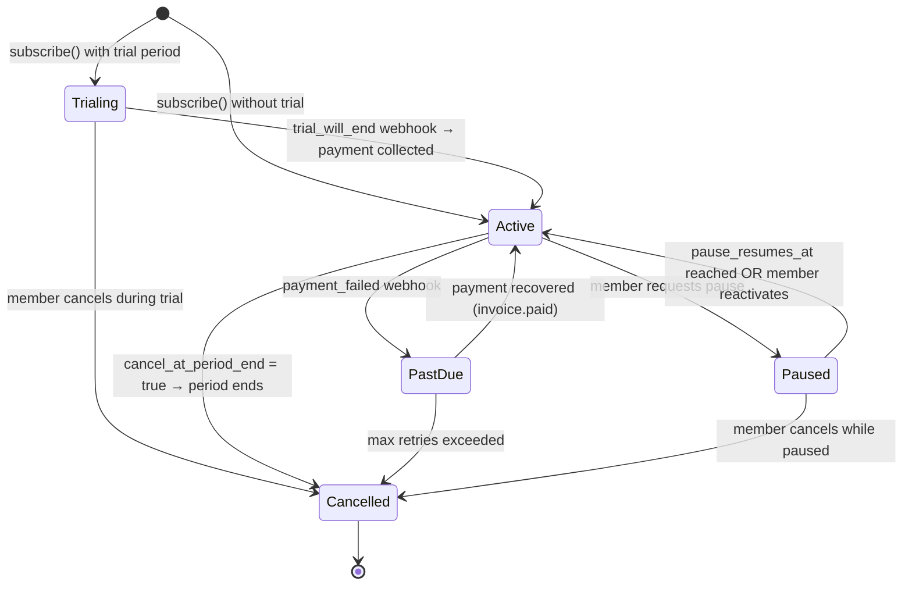
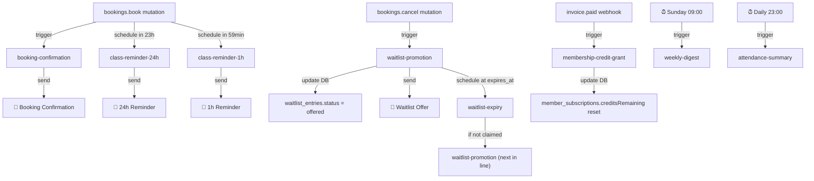
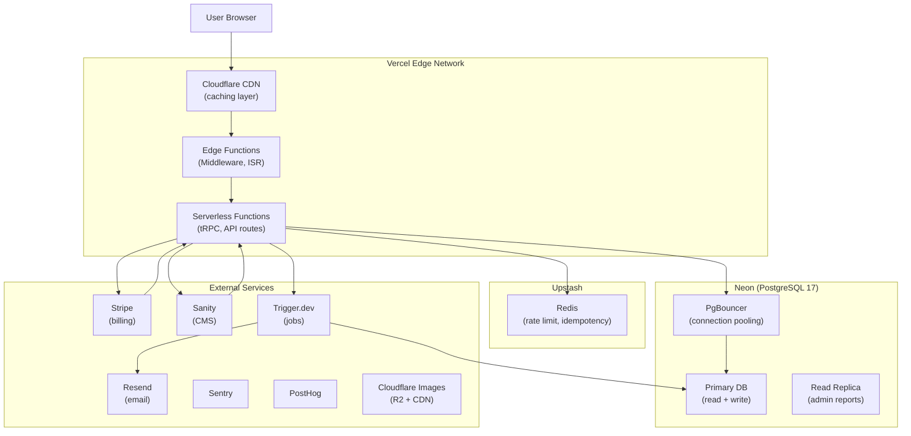

# 🪷 Claw Code — Phase 1–4: ANALYZE → PLAN → VALIDATE → IMPLEMENT

## Executive Summary

The user has given explicit approval to proceed ("awesome meticulous job, keep up the good work"), treating the prior architecture review as the VALIDATE checkpoint. This task is a **pure documentation artifact** — no code risk, maximum value. I will now produce the **definitive Project Architecture Document** for Stillwater, designed to serve as the single source of truth for the entire engineering lifecycle: onboarding, implementation, code review, and long-term maintenance.

**What I will deliver:**
A production-grade `PAD.md` (Project Architecture Document) that is:
- Exhaustive without being verbose — every section earns its presence
- Visually structured with Mermaid diagrams, tables, and decision records
- Actionable — engineers can open this and immediately understand what to build and why
- Living-document-ready — version-controlled, with ADR entries and changelog

---

## Pre-Writing Structural Plan

Before writing, here is the document's skeleton, validated against enterprise PAD standards:

```
PAD STRUCTURE:
══════════════════════════════════════════════════════
 0. Document Control (version, status, changelog)
 1. Executive Summary
 2. Project Vision & Goals
 3. System Context & Stakeholders
 4. Architecture Overview
 5. Technology Stack & Rationale
 6. Monorepo Project Structure
 7. Data Architecture (Schema + ERD)
 8. API Architecture (tRPC)
 9. Authentication & Authorization (RBAC)
10. Frontend Architecture
11. Design System ("Stillwater" Identity)
12. Rendering Strategy
13. Real-Time Architecture (SSE)
14. Content Management Architecture (Sanity)
15. Payment Architecture (Stripe)
16. Email Architecture (React Email + Resend)
17. Background Job Architecture (Trigger.dev)
18. Observability & Monitoring
19. Performance Architecture
20. Security Architecture
21. Testing Strategy
22. Accessibility Architecture
23. SEO Architecture
24. i18n Architecture
25. Deployment & Infrastructure
26. CI/CD Pipeline
27. Development Workflow & Conventions
28. Error Handling Strategy
29. Architecture Decision Records (ADRs)
30. Glossary
31. Appendices
══════════════════════════════════════════════════════
```

Now — implementing the full document:

---

```markdown
# Project Architecture Document
## Stillwater — Yoga Studio Platform

---

> **Document Status:** `ACTIVE — v1.7.0`
> **Classification:** Internal Engineering Reference
> **Audience:** Engineers, Architects, Technical Leads, DevOps
> **Owner:** Engineering Lead
> **Review Cycle:** Quarterly, or upon major architectural change

---

## Document Control

| Version | Date       | Author           | Status   | Summary of Changes            |
|---------|------------|------------------|----------|-------------------------------|
| 1.0.0   | 2025-07-04 | Claw Code / Arch | Active   | Initial comprehensive draft   |
| 1.1.0   | 2026-07-05 | Claw Code / Audit | Active | 5 critical audit fixes (C1–C5) + 11 version-alignment fixes |
| 1.2.0   | 2026-07-05 | Claw Code / Validation | Active | Fix 2 stale "Auth.js" refs in §20.1 OWASP table; fix malformed D9 color token; remove orphaned --color-fog |
| 1.3.0   | 2026-07-05 | Claw Code | Active | ADR-009 softening: `proxy.ts` runtime documented as "Edge or Node.js" (Next.js 16 docs inconsistent on default); ADR-010 (Resend Native Templates) proposed |
| 1.4.0   | 2026-07-07 | Claw Code / Remediation | Active | Phase 0 complete; React Email v6 bundle warning added to §16.3 + ADR-010 context; React pin aligned to actual `^19.2.7`; documentation suite cross-checked against stillwater_SKILL.md v1.4.1 |
| 1.5.0   | 2026-07-07 | Claw Code / Phase 1 | Active | Phase 1 complete — 14 tables, 8 enums, 5 critical indexes (§7.3) implemented via Drizzle ORM in `packages/db/src/schema/`; migration `0000_chemical_obadiah_stane.sql` generated; 91 unit tests + 7 integration tests; db client (`DrizzleDB` type) exported from `packages/db/src/index.ts` (resolves D11); `stripeCustomerId` column added to `members` table (resolves D6); 3 additional indexes beyond §7.3 (`idx_members_stripe_customer_id`, `idx_enrollments_session_member` unique, `idx_role_assignments_member_role` unique); idempotent seed script + local-only reset script |
| 1.6.0   | 2026-07-07 | Claw Code / Phase 2 | Active | Phase 2 complete — Better Auth v1.6.23 fully configured (Google OAuth + Magic Link plugin + customSession plugin for memberId/roles enrichment); 3 Better Auth schema tables added (`session`, `account`, `verification` in `packages/db/src/schema/auth-tables.ts`); `users.emailVerified` changed from `timestamp` to `boolean` (Better Auth requirement); RBAC permission matrix (13 permissions × 6 roles) in `packages/auth/src/rbac.ts`; server-side auth helpers (`getSession`/`requireAuth`/`requireRole`) in `apps/web/src/lib/auth.ts`; 2-layer auth pattern verified (cookie-only `proxy.ts` + 4 layout guards); Better Auth route handler at `/api/auth/[...all]/route.ts`; sign-in page (Google + Magic Link) + sign-out route + error page; migration `0001_supreme_sabretooth.sql`; 220 tests (102 auth + 107 db + 11 web) |
| 1.7.0   | 2026-07-07 | Claw Code / Phase 3 | Active | Phase 3 complete — 10 tRPC routers (~30 procedures) in `packages/api/src/routers/`; 4 procedure access tiers (public/protected/staff/owner) in `packages/api/src/trpc.ts`; booking router uses advisory lock (`pg_advisory_xact_lock`) per ADR-004; rate limiting on `bookings.book` (10/min via Upstash); root router merging all 10 routers in `packages/api/src/root.ts`; web tRPC integration (HTTP handler + RSC server caller + React client + query key factory); `pg` driver added to `packages/db` devDeps for local Postgres migrations (drizzle-kit driver selection fix); Phase 7 procedures stubbed with `PRECONDITION_FAILED`; 326 tests (104 api + 102 auth + 107 db + 13 web) |

### How to Maintain This Document

- All **structural** changes (new service, new data entity, new integration) **require a PAD update** before merging the implementing PR.
- All **architectural decisions** must be logged in [Section 29: ADRs](#29-architecture-decision-records).
- This document lives at the repository root: `/PAD.md`.
- Diagrams are written in Mermaid and render natively in GitHub and most modern IDEs.

---

## Table of Contents

1. [Executive Summary](#1-executive-summary)
2. [Project Vision & Goals](#2-project-vision--goals)
3. [System Context & Stakeholders](#3-system-context--stakeholders)
4. [Architecture Overview](#4-architecture-overview)
5. [Technology Stack & Rationale](#5-technology-stack--rationale)
6. [Monorepo Project Structure](#6-monorepo-project-structure)
7. [Data Architecture](#7-data-architecture)
8. [API Architecture](#8-api-architecture)
9. [Authentication & Authorization](#9-authentication--authorization)
10. [Frontend Architecture](#10-frontend-architecture)
11. [Design System](#11-design-system)
12. [Rendering Strategy](#12-rendering-strategy)
13. [Real-Time Architecture](#13-real-time-architecture)
14. [Content Management Architecture](#14-content-management-architecture)
15. [Payment Architecture](#15-payment-architecture)
16. [Email Architecture](#16-email-architecture)
17. [Background Job Architecture](#17-background-job-architecture)
18. [Observability & Monitoring](#18-observability--monitoring)
19. [Performance Architecture](#19-performance-architecture)
20. [Security Architecture](#20-security-architecture)
21. [Testing Strategy](#21-testing-strategy)
22. [Accessibility Architecture](#22-accessibility-architecture)
23. [SEO Architecture](#23-seo-architecture)
24. [i18n Architecture](#24-i18n-architecture)
25. [Deployment & Infrastructure](#25-deployment--infrastructure)
26. [CI/CD Pipeline](#26-cicd-pipeline)
27. [Development Workflow & Conventions](#27-development-workflow--conventions)
28. [Error Handling Strategy](#28-error-handling-strategy)
29. [Architecture Decision Records](#29-architecture-decision-records)
30. [Glossary](#30-glossary)
31. [Appendices](#31-appendices)

---

## 1. Executive Summary

**Stillwater** is a full-stack, enterprise-grade yoga studio management platform. It serves as both the **public marketing surface** for the studio and a **complete operational platform** for members, instructors, and studio staff.

The system enables:

- **Members** to browse the class schedule, book sessions, manage their membership subscription, join waitlists, and track their attendance history.
- **Instructors** to view their teaching schedule, manage availability, and access class rosters.
- **Studio Staff & Owners** to manage the full class catalog, instructor roster, member accounts, revenue reporting, and studio settings.
- **Content Editors** to update marketing copy, blog posts, instructor bios, and pricing information independently of the engineering team via a headless CMS.

### Guiding Principle

> *Build the platform a boutique wellness studio deserves — not the one a SaaS template provides.*

This means: production-grade reliability, an editorial-quality public surface, and operational tooling that reduces friction for every stakeholder.

---

## 2. Project Vision & Goals

### 2.1 Vision Statement

Stillwater is the operational backbone and digital face of the studio — a platform that reflects the calm intentionality of the practice it serves, while running with the reliability and scalability of enterprise software.

### 2.2 Goals

| # | Goal | Success Metric |
|---|------|----------------|
| G1 | Members can self-serve all booking needs | Zero booking-related support tickets per week |
| G2 | Studio owner can update schedule without engineer involvement | Schedule changes live in < 5 minutes via admin UI |
| G3 | Marketing content updates require zero deployments | Content editor publishes via Sanity; ISR propagates in < 5 min |
| G4 | Platform handles 500 concurrent users without degradation | p95 response time < 200ms at 500 RPS |
| G5 | Payment processing is reliable and auditable | Zero unreconciled transactions; full Stripe webhook audit log |
| G6 | Accessibility is not an afterthought | **Lighthouse Accessibility score: 100 (automated baseline) + quarterly manual screen-reader & keyboard audit (WCAG 2.2 Level AAA target).** Lighthouse wraps axe-core which catches only ~30–57% of WCAG issues; a perfect 100 does NOT equal WCAG compliance. Source: `PAD_audit_report-1.md` §"Lighthouse 100 + WCAG AAA" + Deque Systems axe-core coverage stats. |
| G7 | Engineers can onboard in < 1 day | New dev runs `pnpm dev` successfully within 30 minutes |

### 2.3 Non-Goals (Explicit Scope Exclusions)

- **No native mobile app** — the web application is fully responsive and PWA-capable.
- **No video streaming infrastructure** — virtual class links are external (Zoom/Google Meet URLs stored in the DB).
- **No marketplace / multi-studio support** — this is a single-studio platform; multi-tenancy is not in scope for v1.
- **No AI/ML features** — recommendation engines, personalization, and predictive analytics are future scope.
- **No POS integration** — in-person payments are handled externally; the platform manages online memberships only.

---

## 3. System Context & Stakeholders

### 3.1 Stakeholder Map



### 3.2 System Context Diagram (C4 Level 1)



---

## 4. Architecture Overview

### 4.1 High-Level Architecture (C4 Level 2 — Containers)

```mermaid
C4Container
  title Container Diagram — Stillwater Platform

  Person(user, "User", "Member, Instructor, Staff, or Visitor")

  Container_Boundary(web, "Web Application (apps/web)") {
    Container(nextjs, "Next.js 16 App", "TypeScript, React 19", "Serves marketing pages (ISR), member app (SSR/CSR), admin dashboard (SSR)")
    Container(trpc, "tRPC API Layer", "tRPC v11, Zod", "Type-safe API procedures consumed by the Next.js app")
    Container(proxy, "Proxy (Edge or Node.js)", "Next.js 16 proxy.ts", "Auth cookie check, RBAC route protection, i18n routing (replaces middleware.ts per ADR-009)")
  }

  Container_Boundary(data, "Data Layer (packages/db)") {
    ContainerDb(postgres, "PostgreSQL 17", "Neon (serverless)", "Primary data store: users, classes, bookings, payments")
    ContainerDb(redis, "Redis (Upstash)", "Serverless Redis", "Rate limiting, session cache, idempotency keys")
  }

  Container_Boundary(workers, "Background Services") {
    Container(jobs, "Job Workers", "Trigger.dev v4", "Email dispatch, waitlist promotion, membership renewal, reminders")
  }

  Container_Boundary(content, "Content Layer") {
    Container(sanity, "Sanity Studio", "Sanity v3", "CMS for marketing content: blog, instructors, pricing copy, FAQs")
  }

  Rel(user, nextjs, "Visits", "HTTPS")
  Rel(nextjs, trpc, "Calls procedures", "In-process (server) / HTTPS (client)")
  Rel(trpc, postgres, "Reads/writes", "TCP (Drizzle ORM)")
  Rel(trpc, redis, "Rate limiting, caching", "TCP")
  Rel(trpc, jobs, "Enqueues jobs", "HTTPS")
  Rel(jobs, postgres, "Reads/writes", "TCP")
  Rel(nextjs, sanity, "Fetches content at build/revalidation", "HTTPS")
  Rel(middleware, redis, "Checks rate limit", "TCP")
```

### 4.2 Request Flow — Critical Path: Class Booking



### 4.3 Architecture Pillars

| Pillar | Decision | Rationale |
|--------|----------|-----------|
| **Type Safety** | End-to-end TypeScript strict mode + tRPC | Eliminates runtime type errors across the entire stack |
| **Separation of Concerns** | Domain-grouped route groups, package-per-concern | Prevents feature coupling; enables team scaling |
| **Content Independence** | Sanity CMS for all marketing content | Studio owner changes schedule/copy without a PR |
| **Resilient Payments** | Stripe Billing + idempotent webhooks | No lost revenue from network failures or retries |
| **Async-First** | All side effects (email, notifications) via Trigger.dev | API responses stay fast; side effects are durable |
| **Edge Performance** | ISR + Cloudflare CDN + next/image | LCP < 1.5s on mobile, globally |
| **Security by Default** | RBAC at middleware + procedure level, Zod validation everywhere | Defense in depth; no implicit trust |

---

## 5. Technology Stack & Rationale

### 5.1 Full Stack Decision Matrix

| Layer | Technology | Version | Rationale | Rejected Alternatives |
|-------|-----------|---------|-----------|----------------------|
| **Frontend Framework** | Next.js | `^16.2.0` | App Router, Turbopack stable, React Compiler (opt-in via `reactCompiler: true` — NOT default; requires `babel-plugin-react-compiler` devDependency installed separately), `proxy.ts` (replaces `middleware.ts` — can run on Edge or Node.js runtime; Next.js 16 docs are inconsistent on the default), streaming, ISR, top-level `cacheComponents: true` (moved out of `experimental` in Next.js 16); top-level `serverExternalPackages` (moved from `experimental` in Next.js 15, not 16) | Remix (less ecosystem), Nuxt (different team skills) |
| **UI Library** | React | `^19.2.3` | Concurrent features, `use()`, Server Components. ⚠️ **CVE-2025-55182 floor** ("React2Shell" RCE, CVSS 10.0) — never downgrade below 19.2.3. | — |
| **Language** | TypeScript | `^5.9.0` | Strict mode end-to-end; `noUncheckedIndexedAccess`, `exactOptionalPropertyTypes`, `useUnknownInCatchVariables`, `verbatimModuleSyntax: true` (requires `import type`), `erasableSyntaxOnly: true` (FORBIDS `enum` and `namespace`) | — |
| **Styling** | Tailwind CSS | `^4.3.0` | Utility-first, zero dead CSS in production, v4's CSS-first `@theme`, `@source` directives for monorepo content scanning; `outline-hidden` replaces v3 `outline-none` (v4 `outline-none` now sets `outline-style: none` — different semantics) | CSS Modules (verbose), styled-components (runtime cost) |
| **Component Primitives** | Radix UI | latest | Fully accessible, unstyled, composable | Headless UI (fewer components), Ark UI (less mature) |
| **API Layer** | tRPC | v11 | End-to-end type safety, no code generation, integrates natively with Next.js | REST (no type safety bridge), GraphQL (overkill, complex) |
| **ORM** | Drizzle ORM | `^0.45.0` | Type-safe SQL, zero magic, excellent PostgreSQL support, fast. `db.$count` requires ≥0.34; relational query API v1 (`db.query.*`) since 0.28; v2 (`defineRelations()`) requires ≥1.0.0-beta. | Prisma (slower, heavier, type gen required), Kysely (more verbose) |
| **Database** | PostgreSQL | 17 | Advisory locks for bookings, JSONB for metadata, proven at scale | MySQL (weaker advisory lock support), SQLite (not for prod) |
| **Database Host** | Neon | latest | Serverless PostgreSQL, branching for preview envs, zero cold starts | Supabase (more opinionated), RDS (heavy setup) |
| **Cache / Rate Limit** | Upstash Redis | latest | Serverless Redis, per-request billing, edge-compatible | Redis Cloud (needs VPC), Memcached (no sorted sets) |
| **Auth** | Better Auth | v1.6.23 | Type-safe, framework-agnostic, Drizzle adapter, magic link + OAuth, server-component native; stable v1.x line (Auth.js v5 still beta at 5.0.0-beta.31) | Auth.js v5 (still beta, maintenance handover to Better Auth team Sept 2025), Clerk (vendor lock-in, cost), NextAuth v4 (legacy) |
| **Background Jobs** | Trigger.dev | **v4** | Durable execution, retries, scheduling, excellent DX. **v3 is deprecated — new v3 deploys stop working April 1, 2026; v4 reached GA August 2025.** | Inngest (similar but fewer features), BullMQ (self-hosted complexity) |
| **CMS** | Sanity | v3 | GROQ queries, real-time collaborative editing, webhook-driven ISR | Contentful (expensive), Payload CMS (self-hosted complexity) |
| **Payments** | Stripe | `^22.3.0` | Industry standard, Billing API, webhooks, tax support. ⚠️ **"Dahlia" API (2026-06-24)** pinned by SDK v22; `current_period_end` moved to `items.data[0].current_period_end` (introduced in Basil 2025-03-31, carried forward). SDK exposes **snake_case** to match API wire format (NOT camelCase — use `current_period_end`, not `currentPeriodEnd`). | Paddle (US restrictions), Braintree (complex) |
| **Email Templates** | React Email | `^6.6.6` | JSX email templates, unified package (v6.0.0 paradigm shift April 16, 2026 — `@react-email/components` and `@react-email/render` deprecated, all imports from `react-email` root). ⚠️ v6 bundle is 1.8MB (514KB gzipped) — pulls `prismjs`, `marked`, `tailwindcss` compiler at runtime. See `react_email_suggestion.md` Alternative A (Resend Native Templates) to protect Trigger.dev CPU budgets. | MJML (XML, not TypeScript), Handlebars (no type safety) |
| **Email Delivery** | Resend | `^6.17.1` | Built for developers, React Email native integration, generous free tier (2,400 emails/day). Supports Resend Native Templates (template ID + variables API) as zero-runtime-rendering alternative to local JSX rendering — recommended for Trigger.dev workers to avoid 1.8MB React Email v6 bundle bloat. | SendGrid (complex API), Postmark (no React Email native) |
| **Monorepo** | Turborepo | `^2.10.0` | Incremental builds, task caching, excellent pnpm support; graceful shutdown + deferred input hashing (2.10+) | Nx (heavier), Lerna (legacy) |
| **Package Manager** | pnpm | `^11.0.0` | Workspace support, fast, disk-efficient. `custom-conditions=@stillwater/source` in `.npmrc`. pnpm 9.x is EOL — use 11.x+. | npm (slow workspaces), yarn (inconsistent behavior) |
| **Testing: Unit/Integration** | Vitest | latest | Fast, ESM native, compatible with Vite ecosystem | Jest (slower, ESM friction) |
| **Validation** | Zod | `^4.4.0` | Env module, Server Action inputs, tRPC procedure inputs. Zod v4 `z.string().url()` accepts any scheme → use `z.url({ protocol: /^https:$/ })` (v4 native) or `.refine()` for protocol restriction; enum errors use unified `{ error }` param (string or function) — `{ errorMap }` removed, `{ message }` deprecated; `z.ZodIssueCode` deprecated in v4 → use string literal `'custom'` in `ctx.addIssue()`. | yup (less TypeScript-native), Joi (older) |
| **Testing: E2E** | Playwright | latest | Cross-browser, reliable, component testing support | Cypress (slower, no Firefox) |
| **Analytics** | PostHog | latest | Self-hostable, GDPR-friendly, feature flags, funnels | Mixpanel (cost), Amplitude (cost), GA4 (privacy concerns) |
| **Logging** | Axiom | latest | Structured logs, fast queries, Next.js native integration | Datadog (cost), Papertrail (limited) |
| **Deployment** | Vercel | latest | Zero-config Next.js, edge network, preview deployments | Fly.io (more config), Railway (less edge) |
| **Image CDN** | Cloudflare Images | latest | Transforms on-the-fly, R2 storage, global CDN | Cloudinary (cost), imgix (cost) |
| **Uptime Monitoring** | Checkly | latest | Synthetic monitoring, E2E checks in production | Pingdom (no E2E), Better Uptime |
| **Linting** | ESLint | `^9.39.4` | v9 flat config (`tooling/eslint/index.js`). ⚠️ Do NOT upgrade to v10 — `eslint-plugin-react@7.37.5` and `eslint-plugin-import@2.32.0` have no v10-compatible versions (see MEP D45). v9.39.4 is the `maintenance` dist-tag (actively receiving security/bug fixes). | ESLint v10 (plugin ecosystem hasn't caught up); Biome (less mature plugin ecosystem) |

### 5.2 Node.js & Runtime Versions

```
Node.js:    >= 22.x LTS  (required for native fetch, ESM stability)
pnpm:       11.0.0       (workspace protocol support; pnpm 9.x is EOL — use 11.x+)
TypeScript: ^5.9.0       (const type parameters, inferred type predicates, `erasableSyntaxOnly`, `verbatimModuleSyntax`)
```

---

## 6. Monorepo Project Structure

### 6.1 Directory Topology

```
stillwater/                              # Repository root
├── apps/
│   └── web/                             # Next.js 16 application (Turbopack, React Compiler, proxy.ts)
│       ├── app/
│       │   ├── (marketing)/             # Route group: public, no auth
│       │   │   ├── page.tsx             # / — Home
│       │   │   ├── about/
│       │   │   │   └── page.tsx
│       │   │   ├── instructors/
│       │   │   │   ├── page.tsx         # /instructors — roster
│       │   │   │   └── [slug]/
│       │   │   │       └── page.tsx     # /instructors/:slug — bio
│       │   │   ├── schedule/
│       │   │   │   └── page.tsx         # /schedule — class schedule
│       │   │   ├── classes/
│       │   │   │   ├── page.tsx
│       │   │   │   └── [slug]/
│       │   │   │       └── page.tsx
│       │   │   ├── pricing/
│       │   │   │   └── page.tsx
│       │   │   └── blog/
│       │   │       ├── page.tsx
│       │   │       └── [slug]/
│       │   │           └── page.tsx
│       │   │
│       │   ├── (studio)/                # Route group: auth required (member)
│       │   │   ├── layout.tsx           # Auth guard + member shell
│       │   │   ├── dashboard/
│       │   │   │   └── page.tsx         # /dashboard — member home
│       │   │   ├── book/
│       │   │   │   └── [sessionId]/
│       │   │   │       └── page.tsx     # /book/:sessionId — booking flow
│       │   │   ├── my-classes/
│       │   │   │   └── page.tsx         # Upcoming + past bookings
│       │   │   ├── membership/
│       │   │   │   └── page.tsx         # Subscription management
│       │   │   ├── profile/
│       │   │   │   └── page.tsx
│       │   │   └── waitlist/
│       │   │       └── page.tsx
│       │   │
│       │   ├── (admin)/                 # Route group: staff/owner only
│       │   │   ├── layout.tsx           # RBAC guard + admin shell
│       │   │   ├── admin/
│       │   │   │   ├── page.tsx         # /admin — dashboard overview
│       │   │   │   ├── classes/
│       │   │   │   │   ├── page.tsx     # Class catalog management
│       │   │   │   │   └── [id]/
│       │   │   │   │       └── page.tsx
│       │   │   │   ├── schedule/
│       │   │   │   │   └── page.tsx     # Session scheduling calendar
│       │   │   │   ├── instructors/
│       │   │   │   │   └── page.tsx
│       │   │   │   ├── members/
│       │   │   │   │   ├── page.tsx
│       │   │   │   │   └── [id]/
│       │   │   │   │       └── page.tsx
│       │   │   │   ├── revenue/
│       │   │   │   │   └── page.tsx
│       │   │   │   └── settings/
│       │   │   │       └── page.tsx
│       │   │
│       │   ├── auth/                    # Better Auth route handlers
│       │   │   └── [...all]/
│       │   │       └── route.ts
│       │   │
│       │   ├── api/
│       │   │   ├── trpc/
│       │   │   │   └── [trpc]/
│       │   │   │       └── route.ts     # tRPC HTTP handler
│       │   │   ├── webhooks/
│       │   │   │   ├── stripe/
│       │   │   │   │   └── route.ts     # Stripe webhook receiver
│       │   │   │   └── sanity/
│       │   │   │       └── route.ts     # Sanity revalidation webhook
│       │   │   └── schedule/
│       │   │       └── stream/
│       │   │           └── route.ts     # SSE: live seat availability
│       │   │
│       │   ├── layout.tsx               # Root layout: fonts, providers, analytics
│       │   ├── not-found.tsx
│       │   ├── error.tsx
│       │   └── global-error.tsx
│       │
│       ├── components/                  # App-specific components (non-shared)
│       │   ├── booking/
│       │   │   ├── BookingFlow.tsx
│       │   │   ├── SeatCounter.tsx      # SSE-connected live seat display
│       │   │   ├── WaitlistButton.tsx
│       │   │   └── BookingConfirmation.tsx
│       │   ├── schedule/
│       │   │   ├── ScheduleGrid.tsx
│       │   │   ├── ClassCard.tsx
│       │   │   └── ScheduleFilters.tsx
│       │   ├── dashboard/
│       │   ├── admin/
│       │   └── marketing/
│       │
│       ├── lib/
│       │   ├── trpc/
│       │   │   ├── client.ts            # tRPC client setup
│       │   │   └── server.ts            # Server-side tRPC caller
│       │   ├── auth.ts                  # Better Auth server helpers (requireAuth, requireRole)
│       │   ├── sanity/
│       │   │   ├── client.ts
│       │   │   └── queries.ts           # GROQ queries
│       │   └── utils.ts
│       │
│       ├── proxy.ts                     # Next.js 16 proxy: auth cookie check + RBAC + i18n (replaces middleware.ts per ADR-009)
│       ├── next.config.ts
│       ├── tailwind.config.ts
│       └── package.json
│
├── packages/
│   ├── ui/                              # Shared design system
│   │   ├── src/
│   │   │   ├── components/
│   │   │   │   ├── Button/
│   │   │   │   │   ├── Button.tsx
│   │   │   │   │   ├── Button.test.tsx
│   │   │   │   │   └── index.ts
│   │   │   │   ├── Dialog/
│   │   │   │   ├── Input/
│   │   │   │   ├── Select/
│   │   │   │   ├── Badge/
│   │   │   │   ├── Avatar/
│   │   │   │   ├── Calendar/
│   │   │   │   ├── DataTable/
│   │   │   │   ├── Toast/
│   │   │   │   └── index.ts            # Barrel export
│   │   │   ├── tokens/
│   │   │   │   ├── colors.css          # CSS custom properties
│   │   │   │   ├── typography.css
│   │   │   │   ├── spacing.css
│   │   │   │   └── motion.css
│   │   │   └── fonts/
│   │   │       ├── cormorant/          # Self-hosted
│   │   │       └── dm-sans/            # Self-hosted
│   │   └── package.json
│   │
│   ├── db/                             # Database layer
│   │   ├── src/
│   │   │   ├── schema/
│   │   │   │   ├── users.ts
│   │   │   │   ├── members.ts
│   │   │   │   ├── instructors.ts
│   │   │   │   ├── classes.ts
│   │   │   │   ├── sessions.ts
│   │   │   │   ├── enrollments.ts
│   │   │   │   ├── waitlist.ts
│   │   │   │   ├── memberships.ts
│   │   │   │   ├── payments.ts
│   │   │   │   ├── rooms.ts
│   │   │   │   └── index.ts
│   │   │   ├── migrations/
│   │   │   ├── seed/
│   │   │   │   ├── index.ts
│   │   │   │   └── fixtures/
│   │   │   └── index.ts                # Re-exports db client + schema
│   │   ├── drizzle.config.ts
│   │   └── package.json
│   │
│   ├── api/                            # tRPC router definitions
│   │   ├── src/
│   │   │   ├── routers/
│   │   │   │   ├── classes.ts
│   │   │   │   ├── sessions.ts
│   │   │   │   ├── bookings.ts
│   │   │   │   ├── members.ts
│   │   │   │   ├── instructors.ts
│   │   │   │   ├── memberships.ts
│   │   │   │   ├── payments.ts
│   │   │   │   ├── waitlist.ts
│   │   │   │   ├── schedule.ts
│   │   │   │   └── admin.ts
│   │   │   ├── middleware/
│   │   │   │   ├── auth.ts             # Session verification
│   │   │   │   ├── rbac.ts             # Role enforcement
│   │   │   │   └── rateLimit.ts        # Per-procedure rate limits
│   │   │   ├── trpc.ts                 # Router factory, context type
│   │   │   ├── context.ts              # tRPC context (db, session, jobs)
│   │   │   └── root.ts                 # Root router: merges all sub-routers
│   │   └── package.json
│   │
│   ├── auth/                           # Better Auth v1.6.23 configuration
│   │   ├── src/
│   │   │   ├── config.ts
│   │   │   ├── client.ts
│   │   │   └── types.ts
│   │   └── package.json
│   │
│   ├── email/                          # React Email templates
│   │   ├── src/
│   │   │   ├── templates/
│   │   │   │   ├── BookingConfirmation.tsx
│   │   │   │   ├── BookingCancellation.tsx
│   │   │   │   ├── ClassReminder.tsx
│   │   │   │   ├── WaitlistOffer.tsx
│   │   │   │   ├── WelcomeMember.tsx
│   │   │   │   ├── MembershipRenewal.tsx
│   │   │   │   ├── MembershipCancellation.tsx
│   │   │   │   └── PaymentFailed.tsx
│   │   │   ├── components/
│   │   │   │   ├── EmailLayout.tsx
│   │   │   │   ├── EmailButton.tsx
│   │   │   │   └── EmailFooter.tsx
│   │   │   └── send.ts                 # Resend integration helper
│   │   └── package.json
│   │
│   ├── payments/                       # Stripe abstraction
│   │   ├── src/
│   │   │   ├── client.ts               # Stripe SDK singleton
│   │   │   ├── subscriptions.ts        # Subscription lifecycle
│   │   │   ├── webhooks.ts             # Webhook event handlers
│   │   │   ├── invoices.ts
│   │   │   └── types.ts
│   │   └── package.json
│   │
│   └── config/                         # Shared environment config
│       ├── src/
│       │   └── env.ts                  # t3-env schema (Zod-validated)
│       └── package.json
│
├── services/
│   └── workers/                        # Trigger.dev job definitions
│       ├── src/
│       │   ├── booking-confirmation.ts
│       │   ├── class-reminder.ts
│       │   ├── waitlist-processor.ts
│       │   ├── waitlist-expiry.ts
│       │   ├── membership-renewal.ts
│       │   ├── membership-expiry.ts
│       │   └── weekly-digest.ts
│       ├── trigger.config.ts
│       └── package.json
│
├── tooling/
│   ├── eslint/
│   │   └── index.js                    # Shared ESLint config
│   ├── typescript/
│   │   ├── base.json                   # Shared tsconfig base
│   │   ├── nextjs.json                 # Next.js tsconfig extends
│   │   └── library.json               # Package tsconfig extends
│   └── tailwind/
│       └── base.ts                     # Shared Tailwind config base
│
├── .github/
│   ├── workflows/
│   │   ├── ci.yml                      # PR checks: lint, type-check, test
│   │   ├── deploy-preview.yml          # Vercel preview on PR
│   │   └── deploy-production.yml       # Production deploy on main merge
│   ├── PULL_REQUEST_TEMPLATE.md
│   └── CODEOWNERS
│
├── infrastructure/
│   └── postgres/
│       └── init/
│           └── 00-create-extensions.sql # uuid-ossp + pgcrypto (D18)
├── docker-compose.yml                  # Local development: postgres, redis
├── turbo.json                          # Turborepo pipeline config
├── pnpm-workspace.yaml
├── package.json                        # Root: scripts, devDependencies
└── .env.example                        # All required env vars documented
```

### 6.2 Turborepo Pipeline Configuration

```json
// turbo.json
{
  "$schema": "https://turbo.build/schema.json",
  "globalDependencies": [".env"],
  "tasks": {
    "build": {
      "dependsOn": ["^build"],
      "outputs": [".next/**", "dist/**", "!.next/cache/**"]
    },
    "dev": {
      "cache": false,
      "persistent": true
    },
    "check-types": {
      "dependsOn": ["^build"]
    },
    "lint": {
      "dependsOn": []
    },
    "test": {
      "dependsOn": ["^build"],
      "outputs": ["coverage/**"]
    },
    "test:e2e": {
      "dependsOn": ["build"],
      "cache": false
    },
    "db:migrate": {
      "cache": false
    },
    "db:seed": {
      "cache": false,
      "dependsOn": ["db:migrate"]
    }
  }
}
```

### 6.3 Package Dependency Graph



---

## 7. Data Architecture

### 7.1 Entity Relationship Diagram

> **Implementation Status:** ✅ Phase 1 COMPLETE (2026-07-07). All 14 entities below are implemented as Drizzle `pgTable` definitions in `packages/db/src/schema/`. The `members` table includes an additional `stripeCustomerId` column (D6 fix — not shown in ERD below) for Stripe webhook customer lookups. See `packages/db/src/schema/` for the canonical TypeScript definitions and `packages/db/drizzle/migrations/0000_chemical_obadiah_stane.sql` for the generated DDL.

```mermaid
erDiagram
  USER {
    uuid id PK
    text email UK
    text name
    text image
    timestamp emailVerified
    timestamp createdAt
  }

  MEMBER {
    uuid id PK
    uuid userId FK
    text displayName
    text phone
    date dateOfBirth
    text emergencyContact
    text emergencyPhone
    text notes
    timestamp joinedAt
    timestamp createdAt
  }

  INSTRUCTOR {
    uuid id PK
    uuid userId FK
    text slug UK
    text bio
    text[] specialties
    text imageKey
    boolean isActive
    integer sortOrder
  }

  CLASS_STYLE {
    uuid id PK
    text name
    text description
    text color
  }

  CLASS {
    uuid id PK
    text slug UK
    text title
    text description
    uuid styleId FK
    class_level level
    integer durationMinutes
    integer maxCapacity
    boolean isActive
    text imageKey
    text metaTitle
    text metaDescription
    timestamp createdAt
    timestamp updatedAt
  }

  ROOM {
    uuid id PK
    text name
    integer capacity
    boolean isActive
  }

  CLASS_SESSION {
    uuid id PK
    uuid classId FK
    uuid instructorId FK
    uuid roomId FK
    timestamp startsAt
    timestamp endsAt
    session_status status
    text cancelReason
    integer overrideCapacity
    boolean isVirtual
    text streamUrl
    timestamp createdAt
  }

  ENROLLMENT {
    uuid id PK
    uuid sessionId FK
    uuid memberId FK
    enrollment_status status
    timestamp enrolledAt
    timestamp cancelledAt
    timestamp checkedInAt
    text cancellationReason
    uuid packageCreditId FK
  }

  WAITLIST_ENTRY {
    uuid id PK
    uuid sessionId FK
    uuid memberId FK
    integer position
    timestamp joinedAt
    timestamp notifiedAt
    timestamp expiresAt
    waitlist_status status
  }

  MEMBERSHIP_PLAN {
    uuid id PK
    text name
    text stripePriceId UK
    billing_interval interval
    integer classCreditsPerCycle
    integer guestPassesPerCycle
    boolean allowsVirtual
    boolean allowsInPerson
    boolean isActive
    integer sortOrder
  }

  MEMBER_SUBSCRIPTION {
    uuid id PK
    uuid memberId FK
    uuid planId FK
    text stripeSubscriptionId UK
    subscription_status status
    timestamp currentPeriodStart
    timestamp currentPeriodEnd
    boolean cancelAtPeriodEnd
    timestamp pausedAt
    timestamp pauseResumesAt
    integer creditsRemaining
    timestamp createdAt
  }

  CLASS_PACKAGE {
    uuid id PK
    uuid memberId FK
    text name
    integer totalCredits
    integer usedCredits
    timestamp purchasedAt
    timestamp expiresAt
    text stripePaymentIntentId
  }

  PAYMENT_EVENT {
    uuid id PK
    uuid memberId FK
    text stripeEventId UK
    text type
    jsonb payload
    payment_status status
    timestamp processedAt
    timestamp createdAt
  }

  ROLE_ASSIGNMENT {
    uuid id PK
    uuid memberId FK
    studio_role role
    timestamp assignedAt
  }

  USER ||--o| MEMBER : "has profile"
  USER ||--o| INSTRUCTOR : "is instructor"
  MEMBER ||--o{ ROLE_ASSIGNMENT : "has roles"
  MEMBER ||--o{ ENROLLMENT : "enrolls in"
  MEMBER ||--o{ WAITLIST_ENTRY : "waits for"
  MEMBER ||--o{ MEMBER_SUBSCRIPTION : "subscribes"
  MEMBER ||--o{ CLASS_PACKAGE : "purchases"
  MEMBER ||--o{ PAYMENT_EVENT : "generates"

  CLASS ||--|| CLASS_STYLE : "belongs to"
  CLASS ||--o{ CLASS_SESSION : "has sessions"
  CLASS_SESSION ||--|| INSTRUCTOR : "taught by"
  CLASS_SESSION ||--o| ROOM : "held in"
  CLASS_SESSION ||--o{ ENROLLMENT : "has enrollments"
  CLASS_SESSION ||--o{ WAITLIST_ENTRY : "has waitlist"

  MEMBER_SUBSCRIPTION ||--|| MEMBERSHIP_PLAN : "on plan"
  ENROLLMENT ||--o| CLASS_PACKAGE : "uses credit from"
```

### 7.2 Database Enums

```sql
-- Defined in packages/db/src/schema/enums.ts

CREATE TYPE class_level AS ENUM ('all', 'beginner', 'intermediate', 'advanced');
CREATE TYPE session_status AS ENUM ('scheduled', 'cancelled', 'completed', 'in_progress');
CREATE TYPE enrollment_status AS ENUM ('confirmed', 'cancelled', 'attended', 'no_show');
CREATE TYPE waitlist_status AS ENUM ('waiting', 'offered', 'accepted', 'expired', 'removed');
CREATE TYPE subscription_status AS ENUM ('active', 'paused', 'cancelled', 'past_due', 'trialing', 'incomplete');
CREATE TYPE billing_interval AS ENUM ('month', 'year');
CREATE TYPE studio_role AS ENUM ('member', 'instructor', 'staff', 'manager', 'owner');
CREATE TYPE payment_status AS ENUM ('pending', 'processed', 'failed', 'ignored');
```

### 7.3 Critical Index Strategy

```sql
-- Booking performance: fast seat count
CREATE INDEX idx_enrollments_session_status
  ON enrollments (session_id, status)
  WHERE status = 'confirmed';

-- Schedule queries: date range lookups
CREATE INDEX idx_sessions_starts_at_status
  ON class_sessions (starts_at, status)
  WHERE status = 'scheduled';

-- Waitlist ordering
CREATE INDEX idx_waitlist_session_position
  ON waitlist_entries (session_id, position)
  WHERE status = 'waiting';

-- Member subscription lookup
CREATE INDEX idx_subscriptions_member_status
  ON member_subscriptions (member_id, status)
  WHERE status = 'active';

-- Stripe event idempotency
CREATE UNIQUE INDEX idx_payment_events_stripe_id
  ON payment_events (stripe_event_id);
```

### 7.4 Migration Strategy

```
Tool:     Drizzle Kit (drizzle-orm/kit)
Process:  drizzle-kit generate → review SQL → drizzle-kit migrate
Environments:
  - Local:      docker-compose postgres; pnpm db:migrate
  - Preview:    Neon branch per PR (auto-provisioned via Neon API in CI)
  - Production: Migration runs in deploy job, before new code serves traffic

Rules:
  - NEVER destructive migrations on production without a backup snapshot
  - All migrations are additive by default; deprecate columns before dropping
  - Column renames: add new column → backfill → migrate reads → drop old
  - Every migration PR requires a rollback script as a PR comment
```

---

## 8. API Architecture

> **Implementation Status:** ✅ Phase 3 COMPLETE (2026-07-07). 10 tRPC routers (~30 procedures) implemented in `packages/api/src/routers/`. 4 procedure access tiers (public/protected/staff/owner) in `packages/api/src/trpc.ts`. Booking router uses advisory lock (`pg_advisory_xact_lock`) per ADR-004. Rate limiting on `bookings.book` (10/min via Upstash). Root router merging all 10 routers in `packages/api/src/root.ts`. Web tRPC integration: HTTP handler (`/api/trpc/[trpc]/route.ts`), RSC server caller (`lib/trpc/server.ts`), React client (`lib/trpc/client.tsx`), query key factory (`lib/trpc/query-keys.ts`). Phase 7 procedures (Stripe) stubbed with `PRECONDITION_FAILED`. 326 tests (104 api + 102 auth + 107 db + 13 web).

### 8.1 tRPC Design Principles

```
1. One router per domain entity (not per feature)
2. Procedures are named as verbs: get, list, create, update, delete, + domain-specific
3. All inputs validated with Zod at the procedure boundary
4. No raw DB queries in Next.js components — all data through tRPC
5. Server Components use the server-side tRPC caller (zero HTTP overhead)
6. Client Components use the tRPC React Query client for caching + optimistic updates
```

### 8.2 Router Map

```typescript
// packages/api/src/root.ts

export const appRouter = createTRPCRouter({
  classes:       classesRouter,      // Class catalog CRUD
  sessions:      sessionsRouter,     // Class session management
  bookings:      bookingsRouter,     // Book, cancel, check-in
  waitlist:      waitlistRouter,     // Join, leave, status
  members:       membersRouter,      // Member profile, history
  instructors:   instructorsRouter,  // Instructor profiles
  memberships:   membershipsRouter,  // Plans, subscriptions
  payments:      paymentsRouter,     // Stripe portal, invoices
  schedule:      scheduleRouter,     // Public schedule queries
  admin:         adminRouter,        // Admin-only aggregations
});

export type AppRouter = typeof appRouter;
```

### 8.3 Procedure Access Levels

```typescript
// packages/api/src/trpc.ts

// Three procedure tiers — not two:
export const publicProcedure    = t.procedure;
export const protectedProcedure = t.procedure.use(enforceIsAuthed);
export const staffProcedure     = t.procedure.use(enforceIsAuthed).use(enforceIsStaff);
export const ownerProcedure     = t.procedure.use(enforceIsAuthed).use(enforceIsOwner);
```

### 8.4 Procedure Catalog (Selected Critical Paths)

| Router | Procedure | Access | Method | Description |
|--------|-----------|--------|--------|-------------|
| schedule | `getWeek` | public | query | Returns all sessions for a given ISO week |
| schedule | `getSession` | public | query | Single session with live enrollment count |
| bookings | `book` | protected | mutation | Book a session; auto-waitlists if full |
| bookings | `cancel` | protected | mutation | Cancel booking; triggers waitlist promotion |
| bookings | `checkIn` | staff | mutation | Staff check-in for member attendance |
| waitlist | `join` | protected | mutation | Add to waitlist |
| waitlist | `leave` | protected | mutation | Remove from waitlist |
| waitlist | `claimOffer` | protected | mutation | Accept promoted waitlist spot |
| members | `getProfile` | protected | query | Own member profile |
| members | `getHistory` | protected | query | Attendance + booking history |
| memberships | `getPlans` | public | query | Available membership plans |
| memberships | `subscribe` | protected | mutation | Start subscription via Stripe |
| memberships | `cancel` | protected | mutation | Cancel subscription at period end |
| memberships | `pause` | protected | mutation | Pause subscription |
| payments | `getPortalUrl` | protected | mutation | Stripe customer portal URL |
| payments | `getInvoices` | protected | query | Invoice history |
| admin | `getDashboard` | staff | query | KPI summary for admin home |
| admin | `getRevenue` | staff | query | MRR, churn, attendance metrics |
| admin | `getClassRoster` | staff | query | Session roster with check-in status |

### 8.5 tRPC Context Shape

```typescript
// packages/api/src/context.ts

export interface TRPCContext {
  db:      DrizzleDB;            // Database client
  session: Session | null;       // Better Auth session
  jobs:    TriggerClient;        // Background job client
  redis:   Redis;                // Upstash Redis client
  req:     Request;              // Raw request (for headers, IP)
}
```

---

## 9. Authentication & Authorization

> **Implementation Status:** ✅ Phase 2 COMPLETE (2026-07-07). Better Auth v1.6.23 fully configured in `packages/auth/src/config.ts` with Google OAuth + Magic Link plugin + customSession plugin (session enrichment with `memberId` + `roles`). 3 Better Auth schema tables (`session`, `account`, `verification`) in `packages/db/src/schema/auth-tables.ts`. RBAC permission matrix (13 × 6) in `packages/auth/src/rbac.ts`. Server-side auth helpers in `apps/web/src/lib/auth.ts`. 2-layer auth pattern: Layer 1 (proxy.ts, cookie-only) + Layer 2 (4 layout guards). `users.emailVerified` changed from `timestamp` to `boolean` per Better Auth requirement. Migration `0001_supreme_sabretooth.sql`. 220 tests (102 auth + 107 db + 11 web).

### 9.1 Authentication Flow



### 9.2 Role Permission Matrix

| Permission | Guest | Member | Instructor | Staff | Manager | Owner |
|-----------|:-----:|:------:|:----------:|:-----:|:-------:|:-----:|
| View schedule | ✅ | ✅ | ✅ | ✅ | ✅ | ✅ |
| Book class | ❌ | ✅ | ✅ | ✅ | ✅ | ✅ |
| Cancel own booking | ❌ | ✅ | ✅ | ✅ | ✅ | ✅ |
| View own history | ❌ | ✅ | ✅ | ✅ | ✅ | ✅ |
| View own schedule | ❌ | ❌ | ✅ | ✅ | ✅ | ✅ |
| Check in members | ❌ | ❌ | ❌ | ✅ | ✅ | ✅ |
| View all members | ❌ | ❌ | ❌ | ✅ | ✅ | ✅ |
| Manage class schedule | ❌ | ❌ | ❌ | ✅ | ✅ | ✅ |
| Cancel any booking | ❌ | ❌ | ❌ | ✅ | ✅ | ✅ |
| View revenue reports | ❌ | ❌ | ❌ | ❌ | ✅ | ✅ |
| Manage memberships/pricing | ❌ | ❌ | ❌ | ❌ | ✅ | ✅ |
| Assign roles | ❌ | ❌ | ❌ | ❌ | ❌ | ✅ |
| Studio settings | ❌ | ❌ | ❌ | ❌ | ❌ | ✅ |

### 9.3 Session Token Shape

```typescript
// Extended by Better Auth session callback
interface StillwaterSession {
  user: {
    id:                  string;
    email:               string;
    name:                string | null;
    image:               string | null;
    memberId:            string | null;
    roles:               StudioRole[];
    activeSubscription:  ActiveSubscriptionSummary | null;
  };
  expires: string;
}
```

### 9.4 Middleware Route Protection

```typescript
// apps/web/proxy.ts (Next.js 16 — replaces middleware.ts per ADR-009)

const ROUTE_ROLE_MAP: Record<string, StudioRole[]> = {
  '/dashboard':        ['member', 'instructor', 'staff', 'manager', 'owner'],
  '/book':             ['member', 'instructor', 'staff', 'manager', 'owner'],
  '/admin':            ['staff', 'manager', 'owner'],
  '/admin/revenue':    ['manager', 'owner'],
  '/admin/settings':   ['owner'],
};
```

---

## 10. Frontend Architecture

### 10.1 Component Hierarchy

```
Page (Server Component — data fetching)
└── Layout Shell (Client — nav state, theme)
    └── Feature Section (Server Component)
        └── Interactive Widget (Client — 'use client' boundary)
            └── UI Primitive (Radix-based from packages/ui)
```

### 10.2 Data Fetching Patterns

| Context | Pattern | Why |
|---------|---------|-----|
| Server Component (RSC) | `await serverCaller.schedule.getWeek()` | Zero HTTP round-trip; runs in same process |
| Client Component (initial) | tRPC useQuery with initialData from RSC | Hydrates instantly, then keeps fresh |
| Client Component (mutation) | tRPC useMutation + optimistic update | Instant UI feedback; server confirms asynchronously |
| Admin data tables | tRPC useQuery with React Query pagination | Server-side pagination; cache per page |
| Real-time seat count | SSE via `EventSource` hook | Push updates without polling |

### 10.3 State Management Philosophy

```
No global state manager (Redux, Zustand) is needed.

State lives at the appropriate layer:
  - Server state:        React Query (via tRPC)
  - URL state:           nuqs (type-safe search params)
  - Local UI state:      useState / useReducer
  - Form state:          react-hook-form + Zod resolver
  - Cross-component:     Zustand (ONLY if prop drilling exceeds 3 levels)

If you reach for Zustand for server data, you've made an error.
```

### 10.4 Form Architecture

```typescript
// All forms follow this pattern:
// 1. Define Zod schema (shared with tRPC input)
// 2. useForm with zodResolver
// 3. onSubmit calls tRPC mutation
// 4. Error boundary handles unexpected failures
// 5. Field-level errors from Zod, toast for server errors

const bookingSchema = z.object({
  sessionId: z.string().uuid(),
  notes:     z.string().max(500).optional(),
});

type BookingFormValues = z.infer<typeof bookingSchema>;
```

### 10.5 UI State Completeness Rule

**Every data-dependent UI must implement all four states:**

```
✅ Loading:  Skeleton components (not spinners for layout-defining content)
✅ Error:    Inline error with retry action + Sentry capture
✅ Empty:    Meaningful empty state with a clear call-to-action
✅ Success:  The actual content
```

---

## 11. Design System

### 11.1 Conceptual Direction

**"Editorial Calm"** — The intersection of high-end wellness editorial (Kinfolk / Monocle aesthetics) and Japanese spatial design philosophy (間, *ma* — negative space as active presence). Every design decision is intentional. Nothing decorative without structural purpose.

**Anti-Generic Enforcement Contract:**

```
BANNED:
  ✗ Purple-to-pink gradients on hero sections
  ✗ Inter/Roboto as the only typeface
  ✗ Drop shadows on cards as the primary depth signal
  ✗ "Book a Free Trial" CTAs in rounded pill buttons
  ✗ Stock photography of people meditating in beige rooms
  ✗ Predictable 3-column feature grids
  ✗ Sticky nav with logo left, links center, CTA right

REQUIRED:
  ✓ Typographic hierarchy as the primary structural tool
  ✓ Whitespace used as a luxury signal, not wasted space
  ✓ Asymmetric, editorial grid breaks that feel intentional
  ✓ Color temperature that changes how the user feels, not just what they see
  ✓ Micro-interactions earned through meaning, not decoration
```

### 11.2 Typography System

```css
/* Self-hosted fonts — zero FOUT with size-adjust */
@font-face {
  font-family: 'Cormorant Garamond';
  src: url('/fonts/cormorant/CormorantGaramond-Regular.woff2') format('woff2');
  font-weight: 400;
  font-display: swap;
}

/* Scale: Display → Heading → Body → Caption */
--font-display:   'Cormorant Garamond', Georgia, serif;  /* Serenity, luxury */
--font-body:      'DM Sans', system-ui, sans-serif;       /* Clarity, function */
--font-mono:      'JetBrains Mono', 'Courier New', mono;   /* Data, precision */

/* Type Scale (fluid, clamp-based) */
--text-display-2xl: clamp(3.5rem, 8vw, 7rem);     /* Hero statements */
--text-display-xl:  clamp(2.5rem, 5vw, 4.5rem);   /* Section titles */
--text-display-lg:  clamp(2rem, 4vw, 3.25rem);    /* Page headings */
--text-heading-lg:  clamp(1.5rem, 3vw, 2rem);     /* Sub-headings */
--text-heading-md:  1.25rem;                       /* Card titles */
--text-body-lg:     1.125rem;                      /* Lead paragraphs */
--text-body-md:     1rem;                          /* Default body */
--text-body-sm:     0.875rem;                      /* Captions, labels */
--text-caption:     0.75rem;                       /* Fine print */

/* Line Heights */
--leading-display:  1.05;   /* Tight for large display text */
--leading-heading:  1.2;
--leading-body:     1.65;   /* Generous for reading comfort */
--leading-caption:  1.4;
```

### 11.3 Color System

```css
/* Palette: Warm Mineral — inspired by Japanese natural pigments */
/* NOT the wellness cliché of sage green or lavender */

:root {
  /* Stone — the foundation */
  --color-stone-950: #0F0D0B;   /* Deepest shadow */
  --color-stone-900: #1C1915;   /* Near-black (primary text) */
  --color-stone-800: #2E2B26;
  --color-stone-700: #3D3832;   /* Body text */
  --color-stone-600: #544F48;
  --color-stone-500: #6E6760;   /* Placeholder, disabled */
  --color-stone-400: #8C7B6E;   /* Secondary text */
  --color-stone-300: #B0A49A;
  --color-stone-200: #D4CFC9;  /* Borders */
  --color-stone-100: #E8E3DC;
  --color-stone-50:  #F5F0E8;   /* Page background (warm white) */

  /* Clay — the primary action color (terracotta) */
  --color-clay-600: #8A4030;
  --color-clay-500: #9E5E44;    /* Hover */
  --color-clay-400: #C4856A;    /* Primary CTA */
  --color-clay-300: #D9A48F;
  --color-clay-200: #EDD4C8;
  --color-clay-100: #F7EDE8;    /* Tinted background */

  /* Water — the accent (muted teal, not turquoise) */
  --color-water-700: #4A7280;
  --color-water-600: #5D8A99;
  --color-water-500: #7B9EA8;   /* Accent */
  --color-water-400: #9BBAC5;
  --color-water-300: #B8CDD4;
  --color-water-100: #E8F0F3;

  /* Sand — surfaces */
  --color-sand:      #F5F0E8;   /* Base background */
  --color-sand-warm: #EDE5D8;   /* Card surface */
  --color-sand-deep: #E2D8CB;   /* Hover surface */

  /* Semantic aliases */
  --color-background:  var(--color-sand);
  --color-surface:     var(--color-sand-warm);
  --color-border:      var(--color-stone-200);
  --color-text-primary: var(--color-stone-900);
  --color-text-secondary: var(--color-stone-400);
  --color-action:      var(--color-clay-400);
  --color-action-hover: var(--color-clay-500);
  --color-accent:      var(--color-water-500);

  /* Status colors */
  --color-success: #4A7C59;    /* Muted forest green */
  --color-warning: #C4913A;    /* Warm amber */
  --color-error:   #B85450;    /* Muted red-clay */
  --color-info:    var(--color-water-500);
}
```

### 11.4 Spacing & Layout

```css
/* 4px base grid, Fibonacci-influenced progression */
--space-px:  1px;
--space-0-5: 2px;
--space-1:   4px;
--space-2:   8px;
--space-3:   12px;
--space-4:   16px;
--space-5:   20px;
--space-6:   24px;
--space-7:   32px;  /* ← primary component gap */
--space-8:   48px;
--space-9:   64px;  /* ← section padding */
--space-10:  96px;
--space-11:  128px;
--space-12:  192px; /* ← large section breaks */
--space-13:  256px;

/* Layout grid: editorial, NOT Bootstrap */
--grid-cols-marketing: repeat(12, 1fr);
--grid-gap:            var(--space-7);
--max-width-content:   1280px;
--max-width-narrow:    720px;   /* Editorial reading width */
--max-width-wide:      1440px;
```

### 11.5 Motion System

```css
/* Motion: purposeful, breath-like, never gratuitous */
--ease-gentle:  cubic-bezier(0.16, 1, 0.3, 1);     /* Expo out — snappy settle */
--ease-breathe: cubic-bezier(0.45, 0, 0.55, 1);    /* Sine in-out — organic */
--ease-sharp:   cubic-bezier(0.4, 0, 0.2, 1);       /* Material standard */

--duration-instant:  100ms;
--duration-quick:    150ms;   /* Hover states */
--duration-standard: 300ms;   /* Transitions */
--duration-slow:     600ms;   /* Page reveals */
--duration-crawl:    900ms;   /* Decorative/ambient */

/* Prefers-reduced-motion: respected globally */
@media (prefers-reduced-motion: reduce) {
  *, *::before, *::after {
    animation-duration: 0.01ms !important;
    transition-duration: 0.01ms !important;
  }
}
```

### 11.6 Component Anatomy (Radix-Based)

All interactive components are built on **Radix UI primitives**, styled with Tailwind CSS using the design tokens above. No custom accessibility implementation from scratch.

```
packages/ui/src/components/
├── Button       — Radix Slot + cva variants (primary, ghost, outline, destructive)
├── Input        — Native input + label + error state; accessible by default
├── Select       — Radix Select; styled to match editorial direction
├── Dialog       — Radix Dialog; used for booking confirmation, cancellation
├── Popover      — Radix Popover; used for filter dropdowns
├── Calendar     — Radix (or react-day-picker); schedule date picker
├── Toast        — Radix Toast; global notification system (Sonner preferred)
├── Badge        — Enrollment status, class level, membership tier
├── Avatar       — Member/instructor avatar with fallback initials
├── DataTable    — TanStack Table + Radix; admin member/class lists
├── Skeleton     — Loading state system; matches exact layout of loaded state
└── ProgressBar  — Seat availability visual indicator
```

---

## 12. Rendering Strategy

### 12.1 Route Rendering Decision Map

```
Route                         Strategy      Revalidation    Rationale
──────────────────────────────────────────────────────────────────────────────
/                             ISR           3600s (1hr)     Marketing; rare updates
/about                        ISR           86400s (24hr)   Static content
/instructors                  ISR           86400s (24hr)   Bios rarely change
/instructors/[slug]           ISR           86400s (24hr)   Per-instructor page
/schedule                     ISR           300s (5min)     Schedule changes weekly
/classes                      ISR           3600s (1hr)     Catalog changes deliberately
/classes/[slug]               ISR           3600s (1hr)     Per-class marketing page
/pricing                      ISR           3600s (1hr)     Pricing is deliberate
/blog                         ISG + ODR     On Sanity pub   Blog index
/blog/[slug]                  SSG + ODR     On Sanity pub   Article page
/dashboard                    SSR           No cache        Personalized; auth-gated
/book/[sessionId]             CSR           n/a             Real-time seat data via SSE
/my-classes                   SSR           No cache        Personal history
/membership                   SSR           No cache        Subscription state
/profile                      SSR           No cache        Personal data
/admin/*                      SSR           No cache        Operational; always fresh
/api/trpc/*                   Dynamic       Per-procedure   tRPC manages its own cache
/api/webhooks/*               Dynamic       No cache        Event processing
/api/schedule/stream          Streaming     n/a             SSE endpoint
──────────────────────────────────────────────────────────────────────────────
ISR = Incremental Static Regeneration
ISG = Incremental Static Generation  
ODR = On-Demand Revalidation (webhook-triggered)
SSR = Server-Side Rendering (per-request)
CSR = Client-Side Rendering
SSG = Static Site Generation
```

### 12.2 Cache Revalidation Flow

```mermaid
flowchart LR
  Editor["Content Editor\n(Sanity Studio)"]
  Sanity["Sanity CMS"]
  Webhook["POST /api/webhooks/sanity"]
  Next["Next.js\nrevalidatePath()"]
  CDN["Cloudflare CDN"]
  User["User"]

  Editor -->|Publish changes| Sanity
  Sanity -->|Webhook on publish| Webhook
  Webhook -->|revalidatePath('/blog')| Next
  Next -->|Purges ISR cache| CDN
  User -->|Next request| CDN
  CDN -->|Fresh page| User
```

---

## 13. Real-Time Architecture

### 13.1 Use Case: Live Seat Availability

The booking page must show **accurate, live seat counts** to prevent optimistic overbooking and to build urgency ("2 spots left"). This uses **Server-Sent Events (SSE)** rather than WebSockets because:
- The data flow is **server → client only** (no client push needed)
- SSE works over standard HTTP/2; no separate WebSocket server
- Works natively on Vercel serverless with streaming responses



### 13.2 SSE Implementation Pattern

```typescript
// apps/web/app/api/schedule/stream/route.ts

export const runtime = 'nodejs';
// ⚠️ Do NOT set `export const dynamic = 'force-dynamic'` — incompatible with `cacheComponents: true` (build error per Next.js 16). Route handlers that read `req.url` or stream are dynamic by default.

// ⚠️ Critical (audit-verified): Vercel serverless functions have a default timeout
// (10s Hobby, 15s Pro default) that will silently terminate this SSE stream.
// The stream polls every 10s indefinitely, so it WILL hit the default timeout.
// As of June 2026, Vercel allows up to 30 minutes (1800s) on Pro/Enterprise,
// but this requires BOTH `maxDuration` AND enabling Fluid Compute in project settings.
// Source: PAD_audit_report-1.md §"SSE on Vercel" + PAD_audit_report-2.md §A.
export const maxDuration = 300;  // 5 minutes — balances live-seat freshness vs connection cost
// For longer sessions, increase to 1800 (30 min) and ensure Fluid Compute is enabled.
// The client-side EventSource auto-reconnects on disconnect (ADR-006), so brief
// staleness during reconnection is acceptable.

export async function GET(req: Request) {
  const { searchParams } = new URL(req.url);
  const sessionId = searchParams.get('sessionId');

  if (!sessionId) return new Response('Missing sessionId', { status: 400 });

  const encoder = new TextEncoder();
  let intervalId: NodeJS.Timeout;

  const stream = new ReadableStream({
    start(controller) {
      const send = async () => {
        const count = await db
          .select({ count: count() })
          .from(enrollments)
          .where(and(
            eq(enrollments.sessionId, sessionId),
            eq(enrollments.status, 'confirmed'),
          ));

        const session = await db.query.classSessions.findFirst({
          where: eq(classSessions.id, sessionId),
          with: { class: { columns: { maxCapacity: true } } },
        });

        const capacity = session?.overrideCapacity ?? session?.class.maxCapacity ?? 0;
        const enrolled = count[0]?.count ?? 0;

        const data = JSON.stringify({
          enrolled,
          capacity,
          available: Math.max(0, capacity - enrolled),
          isFull: enrolled >= capacity,
        });

        controller.enqueue(encoder.encode(`data: ${data}\n\n`));
      };

      void send();
      intervalId = setInterval(() => void send(), 10_000);
    },
    cancel() {
      clearInterval(intervalId);
    },
  });

  return new Response(stream, {
    headers: {
      'Content-Type':  'text/event-stream',
      'Cache-Control': 'no-cache, no-transform',
      'Connection':    'keep-alive',
    },
  });
}
```

---

## 14. Content Management Architecture

### 14.1 Sanity CMS Content Models

```
Sanity Studio manages ONLY marketing content.
Operational data (classes, sessions, bookings) lives in PostgreSQL.

Sanity Content Types:
─────────────────────────────────────────────────────────────
  siteSettings        — Studio name, address, hours, social links
  homePage            — Hero content, featured classes, testimonials
  aboutPage           — Studio story, values, team narrative
  blogPost            — Author, publishedAt, body (Portable Text), tags
  faq                 — Question + answer pairs, categorized
  instructorBio       — Extended bio, gallery (supplements DB record)
  testimonial         — Member quote, name, class, rating
  announcement        — Time-bound banner (e.g., "Studio closed Dec 25")
─────────────────────────────────────────────────────────────
```

### 14.2 Sanity ↔ PostgreSQL Boundary

```
┌─────────────────────┐    ┌─────────────────────────────────┐
│    Sanity CMS       │    │         PostgreSQL               │
│                     │    │                                  │
│  • Studio story     │    │  • Class definitions             │
│  • Blog posts       │    │  • Class sessions + schedule     │
│  • FAQs             │    │  • Enrollments                   │
│  • Testimonials     │    │  • Members + subscriptions       │
│  • Announcements    │    │  • Payments                      │
│  • Hero copy        │    │  • Instructors (operational)     │
│  • Team narrative   │    │  • Rooms, capacity               │
│                     │    │                                  │
│  Changed by:        │    │  Changed by:                     │
│  Content editors    │    │  Studio owners via admin UI      │
└─────────────────────┘    └─────────────────────────────────┘
```

### 14.3 GROQ Query Patterns

```typescript
// packages/api (or apps/web/lib/sanity/queries.ts)

// Blog post with author — fetched at build time (ODR)
export const blogPostQuery = groq`
  *[_type == "blogPost" && slug.current == $slug][0] {
    title,
    publishedAt,
    "slug": slug.current,
    body,
    "author": author->{ name, image },
    "tags": tags[]->{ title, "slug": slug.current }
  }
`;

// Homepage content — ISR 1hr
export const homePageQuery = groq`
  *[_type == "homePage"][0] {
    hero { headline, subheadline, ctaLabel, ctaHref },
    "featuredClasses": featuredClasses[]->{ title, slug, description, level },
    testimonials[]{ quote, memberName, className, rating }
  }
`;
```

---

## 15. Payment Architecture

### 15.1 Stripe Entity Mapping

```
Stripe Object          ↔    Stillwater Concept
──────────────────────────────────────────────────────
Customer               ↔    Member (1:1, stored in members.stripeCustomerId)
Product                ↔    MembershipPlan.name
Price                  ↔    MembershipPlan.stripePriceId
Subscription           ↔    MemberSubscription.stripeSubscriptionId
Invoice                ↔    Monthly/annual billing record
PaymentIntent          ↔    ClassPackage purchase
Webhook Event          ↔    PaymentEvent (idempotent audit log)
```

### 15.2 Subscription Lifecycle State Machine



### 15.3 Webhook Reliability Architecture

```
Problem:  Stripe webhooks can be retried. Processing an event twice must be safe.
Solution: Idempotency via PaymentEvent table + advisory lock.

Webhook Handler Flow:
1. Verify Stripe signature (stripe.webhooks.constructEvent)
2. Check payment_events table for stripe_event_id → if exists, return 200 (already processed)
3. Acquire `pg_advisory_xact_lock(hash(event.id))` → prevents concurrent processing of same event (transaction-scoped — auto-releases at COMMIT/ROLLBACK; **do NOT use session-scoped `pg_advisory_lock`** which breaks under Neon's PgBouncer transaction pooling and can leak)
4. Process event (update subscription status, provision credits, etc.)
5. Insert payment_events record with status = 'processed' — lock auto-releases at transaction COMMIT
6. Return 200

> ⚠️ **Critical (audit-verified):** The original draft of this section specified `pg_advisory_lock()` (session-scoped). Under Neon's managed PgBouncer (transaction pooling mode, the default), session-scoped locks are NOT guaranteed to release on the same backend that acquired them — this causes lock leaks and pool exhaustion. The booking flow (§4.2) correctly uses `pg_advisory_xact_lock()`; the webhook handler MUST use the same. Source: `PAD_audit_report-1.md` §"Advisory Lock Inconsistency" + `PAD_audit_report-2.md` §B + Neon FAQ on built-in connection pooling.

Events Handled:
  customer.subscription.created      → Create MemberSubscription record
  customer.subscription.updated      → Sync status, period dates
  customer.subscription.deleted      → Mark as cancelled
  invoice.paid                       → Credit member's monthly credits
  invoice.payment_failed             → Mark past_due, trigger retry email
  invoice.payment_action_required    → Send 3DS authentication email
  customer.subscription.trial_will_end → Send trial ending notification
```

### 15.4 Credit System

```
Members on a credit plan (e.g., "8 classes/month") receive credits:
  - At subscription creation (first period)
  - At each invoice.paid event (subsequent periods)
  - Credits do NOT roll over (expire at period end)
  - Credits are consumed at booking time (transactionally)
  - A credit ledger is maintained in class_packages for audit
```

---

## 16. Email Architecture

### 16.1 Email Template Catalog

| Template | Trigger | Subject Line |
|----------|---------|--------------|
| `WelcomeMember` | User account created | "Welcome to Stillwater, {name}" |
| `BookingConfirmation` | Enrollment created | "You're booked: {class} on {date}" |
| `BookingCancellation` | Enrollment cancelled by member | "Booking cancelled — {class}" |
| `ClassCancellation` | Session cancelled by staff | "Class cancelled: {class} on {date}" |
| `ClassReminder24h` | 24h before session | "Tomorrow: {class} at {time}" |
| `ClassReminder1h` | 1h before session | "Starting soon: {class} at {time}" |
| `WaitlistOffer` | Spot opens for waitlisted member | "A spot opened! Claim your place in {class}" |
| `WaitlistExpired` | Offer window expires | "Your spot offer has expired" |
| `MembershipRenewal` | 3 days before renewal | "Your membership renews on {date}" |
| `PaymentFailed` | invoice.payment_failed | "Action required: Payment failed" |
| `MembershipCancelled` | Subscription cancelled | "Your membership has been cancelled" |
| `MembershipPaused` | Subscription paused | "Your membership is paused until {date}" |
| `WeeklyDigest` | Every Sunday at 9am | "Your week at Stillwater ✦" |

### 16.2 Email Design System

```
All emails share:
  - Font: System serif stack (email-safe Cormorant fallback)
  - Color: Full Stillwater token set (safe hex values, not CSS vars)
  - Layout: Single-column (600px max), generous padding
  - Footer: Unsubscribe link, studio address (CAN-SPAM / GDPR compliant)
  - Alt text: All images have descriptive alt text
  - Plain text: All emails have a plain text version generated automatically
```

### 16.3 Email Rendering Strategy (React Email v6 + Resend)

> ⚠️ **Paradigm Shift (April 16, 2026):** React Email v6.0.0 unified all component packages (`@react-email/components`, `@react-email/render`, `@react-email/button`, etc.) into a single `react-email` package. All imports must come from the `react-email` root. The v0.x sub-packages are deprecated. See `react_email_suggestion.md` for full analysis (cited in MEP D43).

**Bundle Bloat Risk:** React Email v6.6.0 is 1.8MB (514KB gzipped) and pulls `prismjs`, `marked` (markdown parser), and the full `tailwindcss` compiler into runtime bundles via top-level imports. This threatens Trigger.dev worker CPU budgets (30s for `booking-confirmation`, 30s for `waitlist-promotion` — see §17.1) and Edge middleware bundle limits.

**Rendering Decision (pending ADR-010):**

| Approach | Pros | Cons | Recommendation |
|---|---|---|---|
| **A. Resend Native Templates** (zero-runtime rendering) | Zero bundle bloat in workers; 0ms rendering CPU time; leverages Resend's edge network | Requires managing templates in Resend dashboard or CI/CD scripts | ✅ **Recommended** for Trigger.dev workers |
| **B. Local JSX rendering** (`import { render } from 'react-email'`) | Full React component composition; type-safe templates | 1.8MB bundle in every worker cold start; may exhaust CPU budget | Acceptable for Next.js Server Components (not workers) |
| **C. MJML** (via `mjml-react`) | 421KB gzipped (much smaller); reliable cross-client | Loss of native React composition; new syntax to learn | Not recommended — unnecessary migration cost |
| **D. Isolated rendering microservice** | Keeps bloat out of workers + Edge | Adds infrastructure complexity (violates §2.3 "no infra management") | Not recommended |

**Implementation Guidance (Phase 8):**
- `packages/email/src/send.ts` (F8-29) should use `import { render } from 'react-email'` (v6 unified import, NOT `@react-email/render`).
- For Trigger.dev workers (F8-01…F8-12), strongly prefer **Resend Native Templates**: `resend.emails.send({ to, subject, templateId, variables: props })` — this sends a JSON payload to Resend, which handles HTML rendering on its infrastructure.
- For Next.js Server Component email sending (rare — e.g., welcome email on signup), local JSX rendering via `render()` is acceptable since Server Components run on Node.js with no strict CPU budget.
- **ADR-010** (pending) will formally adopt Alternative A for Trigger.dev workers.

---

## 17. Background Job Architecture

### 17.1 Job Catalog

| Job ID | Trigger | Target CPU Budget | Retries | Description |
|--------|---------|-------------------|---------|-------------|
| `booking-confirmation` | Booking mutation | 30s | 3 | Send confirmation email |
| `class-reminder-24h` | Scheduled (24h before session) | 30s | 3 | Reminder email + push |
| `class-reminder-1h` | Scheduled (1h before session) | 30s | 3 | Final reminder |
| `class-cancellation-notify` | Session status → cancelled | 60s | 3 | Notify all enrollees |
| `waitlist-promotion` | Enrollment cancelled | 30s | 3 | Offer spot to next in line |
| `waitlist-expiry` | Scheduled (offer expires_at) | 30s | 3 | Expire offer, promote next |
| `membership-credit-grant` | invoice.paid webhook | 30s | 5 | Credit member for new period |
| `membership-expiry-warn` | Scheduled (3 days before renewal) | 30s | 3 | Renewal reminder email |
| `payment-failed-notify` | invoice.payment_failed | 30s | 3 | Payment failure email |
| `weekly-digest` | Cron: Sunday 09:00 local | 120s | 2 | Weekly schedule digest |
| `attendance-summary` | Cron: Daily 23:00 | 60s | 2 | Mark no-shows, update stats |

> ⚠️ **Critical (audit-verified):** The column is labeled "Target CPU Budget" (not "Timeout") because Trigger.dev's `maxDuration` measures **active CPU time**, NOT wall-clock time — time spent waiting on `triggerAndWait` or `wait.for` calls is excluded. Source: `PAD_audit_report-1.md` §"Trigger.dev Retry Config" + `PAD_audit_report-2.md` §C + Trigger.dev docs on max-duration. The `maxDuration` MUST be set in `trigger.config.ts` below (or per-task); if unset, tasks run indefinitely.

### 17.2 Trigger.dev Configuration

```typescript
// services/workers/trigger.config.ts

import { defineConfig } from '@trigger.dev/sdk';  // v4 — root import (NOT /v3 which is deprecated, NOT /v4 which doesn't exist)

export default defineConfig({
  project: 'stillwater-prod',
  runtime: 'node',
  logLevel: 'info',
  // ⚠️ maxDuration measures ACTIVE CPU TIME, not wall-clock time.
  // Time spent on triggerAndWait / wait.for is excluded.
  // Source: PAD_audit_report-1.md §"Trigger.dev Retry Config".
  maxDuration: 120,  // 120s CPU budget — covers the longest job (weekly-digest)
  retries: {
    enabledInDev: false,
    default: {
      maxAttempts: 3,
      minTimeoutInMs: 1000,
      maxTimeoutInMs: 10_000,
      factor: 2,
      randomize: true,
    },
  },
  dirs: ['./src'],
});
```

### 17.3 Job Dependency Graph



---

## 18. Observability & Monitoring

### 18.1 Observability Stack Overview

```
Layer              Tool              Purpose
─────────────────────────────────────────────────────────────
Error Tracking     Sentry            Exceptions, source maps, session replay
Product Analytics  PostHog           User behavior, funnels, feature flags
Structured Logs    Axiom             All server logs; queryable, retentioned
Uptime / Synthetic Checkly           E2E health checks in production
Performance        Vercel Analytics  Core Web Vitals, per-route performance
Job Monitoring     Trigger.dev UI    Job runs, failures, retries
Payment Audit      Stripe Dashboard  All payment events, reconciliation
DB Performance     Neon Console      Query performance, slow query log
```

### 18.2 Critical Events to Track (PostHog)

```typescript
// Event taxonomy — all events snake_case, past tense
const ANALYTICS_EVENTS = {
  // Acquisition
  PAGE_VIEWED:              'page_viewed',
  SCHEDULE_BROWSED:         'schedule_browsed',
  CLASS_DETAIL_VIEWED:      'class_detail_viewed',
  PRICING_VIEWED:           'pricing_viewed',

  // Activation
  SIGNUP_STARTED:           'signup_started',
  SIGNUP_COMPLETED:         'signup_completed',
  FIRST_CLASS_BOOKED:       'first_class_booked',

  // Engagement
  CLASS_BOOKED:             'class_booked',
  CLASS_CANCELLED:          'class_cancelled',
  WAITLIST_JOINED:          'waitlist_joined',
  WAITLIST_SPOT_CLAIMED:    'waitlist_spot_claimed',
  CHECK_IN_COMPLETED:       'check_in_completed',

  // Revenue
  MEMBERSHIP_STARTED:       'membership_started',
  MEMBERSHIP_UPGRADED:      'membership_upgraded',
  MEMBERSHIP_PAUSED:        'membership_paused',
  MEMBERSHIP_CANCELLED:     'membership_cancelled',
  PAYMENT_FAILED:           'payment_failed',
  PAYMENT_RECOVERED:        'payment_recovered',
} as const;
```

### 18.3 Alerting Thresholds

| Alert | Threshold | Channel | Severity |
|-------|-----------|---------|----------|
| Error rate spike | > 1% of requests → 5xx | Slack #alerts | 🔴 Critical |
| Booking failure rate | > 5% of book mutations fail | Slack #alerts | 🔴 Critical |
| Stripe webhook failures | Any unprocessed event > 5min | PagerDuty | 🔴 Critical |
| DB connection pool exhausted | Pool usage > 90% | Slack #alerts | 🟡 Warning |
| SSE endpoint down | Checkly synthetic fails | Slack #alerts | 🟡 Warning |
| Job queue backed up | > 50 pending jobs | Slack #alerts | 🟡 Warning |
| LCP regression | > 2.5s on any marketing page | Slack #perf | 🟠 Important |
| Churn rate spike | > 10% MoM increase | Slack #business | 🟡 Warning |

---

## 19. Performance Architecture

### 19.1 Core Web Vitals Targets

```
Metric    Target    Critical Threshold    Measurement Context
─────────────────────────────────────────────────────────────
LCP       < 1.5s    > 4.0s = fail        Mobile, Slow 4G, P75
INP       < 100ms   > 500ms = fail       All devices, P75
CLS       < 0.05    > 0.25 = fail        All pages
TTFB      < 200ms   > 800ms = fail       Marketing pages (ISR/CDN)
FCP       < 1.0s    > 3.0s = fail        Mobile, Slow 4G
```

### 19.2 Bundle Size Budget

```
Page                       JS Budget (gzipped)    Notes
────────────────────────────────────────────────────────────────
/ (home)                   < 60kb                 RSC, minimal client JS
/schedule                  < 90kb                 Filter interactivity
/book/[sessionId]          < 180kb                Stripe.js + booking flow
/dashboard                 < 150kb                Member app shell
/admin/*                   < 350kb                TanStack Table, charts
────────────────────────────────────────────────────────────────
```

### 19.3 Image Optimization Strategy

```
All images served through Cloudflare Images:
  1. Upload: Staff uploads via admin UI → Cloudflare Images API
  2. Storage: Cloudflare R2 (S3-compatible, zero egress cost)
  3. Delivery: Cloudflare Images transforms on-the-fly:
       - WebP/AVIF conversion (format negotiation)
       - Responsive sizes (srcset generated automatically)
       - Lazy loading (native + Intersection Observer)
  4. In Next.js:
       - next/image for all images (LCP optimization, CLS prevention)
       - Explicit width/height on all images (no layout shift)
       - priority={true} ONLY on above-fold LCP image
       - Placeholder="blur" with blurDataURL for perceived performance

Image Sizing Conventions:
  Hero images:       1920×1080, AVIF/WebP
  Instructor photos: 600×800 (portrait), AVIF/WebP
  Class thumbnails:  800×600, AVIF/WebP
  Blog hero:         1200×630, AVIF/WebP
  OG images:         1200×630, PNG (generated via @vercel/og)
```

### 19.4 Database Query Optimization

```
Rules:
  1. No N+1 queries — always use Drizzle's 'with' for relations
  2. All list queries paginated (cursor-based for large datasets)
  3. SELECT only needed columns — never SELECT *
  4. Explain Analyze on any query touching > 10,000 rows
  5. Connection pooling via PgBouncer (provided by Neon)
  6. Long-running queries (admin reports) use background jobs

Slow Query Threshold: Log any query > 100ms
Connection Pool Size: max 10 per serverless instance (Neon limit)
```

---

## 20. Security Architecture

### 20.1 OWASP Top 10 Mitigation Map

| OWASP Risk | Mitigation in Stillwater |
|-----------|--------------------------|
| A01: Broken Access Control | RBAC at middleware + procedure level; no client-side role trust |
| A02: Cryptographic Failures | HTTPS enforced; session tokens encrypted (Better Auth); secrets in env vars only |
| A03: Injection | Drizzle ORM parameterized queries everywhere; no raw SQL string interpolation |
| A04: Insecure Design | Threat model documented; STRIDE analysis for booking + payment flows |
| A05: Security Misconfiguration | `.env.example` documents all vars; no defaults in production config |
| A06: Vulnerable Components | Dependabot + `pnpm audit` in CI; weekly automated PRs |
| A07: Auth Failures | Better Auth with secure cookie settings; magic link with expiry; rate limiting on auth endpoints |
| A08: Software Integrity | Stripe signature verification on all webhooks; Sanity webhook secret |
| A09: Logging Failures | All mutations logged in Axiom with userId; payment events in DB audit log |
| A10: SSRF | No user-supplied URLs followed server-side; allowlist for external requests |

### 20.2 Rate Limiting Strategy

```typescript
// Rate limits applied at Edge Middleware (Upstash Redis)

const RATE_LIMITS = {
  // Auth endpoints
  'auth/signin':          { requests: 5,   window: '1m' },
  'auth/magic-link':      { requests: 3,   window: '5m' },

  // Mutations (per authenticated user)
  'bookings.book':        { requests: 10,  window: '1m' },
  'bookings.cancel':      { requests: 10,  window: '1m' },
  'memberships.subscribe':{ requests: 3,   window: '5m' },

  // Public API (per IP)
  'schedule.getWeek':     { requests: 60,  window: '1m' },
  'trpc.*':               { requests: 100, window: '1m' },
} as const;
```

### 20.3 Input Validation Architecture

```
All inputs validated at TWO layers:
  1. Client-side: react-hook-form + Zod resolver (UX feedback, not security)
  2. Server-side: tRPC Zod input schemas (security boundary — never trust client)

Never validate only on the client.
Never trust req.body without Zod parsing.
```

### 20.4 Secret Management

```
Development:  .env.local (gitignored; .env.example committed)
Preview:      Vercel environment variables (per-branch)
Production:   Vercel environment variables (encrypted at rest)

Secret Rotation Policy:
  - Stripe keys: Rotate annually, immediately on suspected compromise
  - Auth secret: Rotate if any infrastructure change
  - Sanity token: Rotate annually
  - Resend API key: Rotate annually

NEVER:
  - Commit secrets to git
  - Log secrets
  - Pass secrets through client-side code
  - Store secrets in database
```

### 20.5 Content Security Policy

```
# Strict CSP headers via next.config.ts
Content-Security-Policy:
  default-src 'self';
  script-src 'self' https://js.stripe.com https://cdn.jsdelivr.net;
  style-src 'self' 'unsafe-inline';  # Required for Tailwind; hash in v2
  img-src 'self' data: https://*.cloudflare.com https://cdn.sanity.io;
  font-src 'self';
  connect-src 'self' https://api.stripe.com https://*.posthog.com https://*.sentry.io;
  frame-src https://js.stripe.com;
  object-src 'none';
  base-uri 'self';
  form-action 'self';
  upgrade-insecure-requests;
```

---

## 21. Testing Strategy

### 21.1 TDD Mandate

```
Test-Driven Development is MANDATORY for all business logic.
Exception: Pure styling/layout changes with no logic.

Cycle per unit of work:
  RED   → Write failing test that describes intended behavior
  GREEN → Write minimum code to make test pass
  REFACTOR → Clean without changing behavior
  COMMIT → One atomic commit per cycle
```

### 21.2 Testing Pyramid

```
                    ╔═══════════════╗
                    ║   E2E Tests   ║  ~20 tests
                    ║  (Playwright) ║  Critical user journeys
                    ╠═══════════════╣
                  ╔═══════════════════╗
                  ║ Integration Tests  ║  ~80 tests
                  ║  (Vitest + DB)    ║  Full transaction flows
                  ╠═══════════════════╣
              ╔═══════════════════════════╗
              ║       Unit Tests          ║  ~300 tests
              ║  (Vitest, fast, isolated) ║  Pure business logic
              ╚═══════════════════════════╝
```

### 21.3 Unit Test Coverage Targets

| Package | Target Coverage | Priority Areas |
|---------|----------------|----------------|
| `packages/api/routers/*` | 90% | Booking logic, waitlist, credit consumption |
| `packages/payments/*` | 95% | Subscription state machine, webhook handlers |
| `packages/db/schema/*` | 80% | Constraints, relationships |
| `apps/web/components/*` | 70% | Interaction behavior, state transitions |
| `services/workers/*` | 85% | Job execution, error paths |

### 21.4 Critical Integration Test Scenarios

```typescript
// Test IDs and descriptions for the integration suite

describe('Booking Flow', () => {
  it('BOOK-001: Books confirmed session for member with active subscription')
  it('BOOK-002: Adds to waitlist when session is at capacity')
  it('BOOK-003: Prevents double-booking same session')
  it('BOOK-004: Consumes one credit from package on booking')
  it('BOOK-005: Rejects booking for member with no active subscription or package')
  it('BOOK-006: Handles concurrent booking attempts via advisory lock')
});

describe('Cancellation & Waitlist', () => {
  it('WAIT-001: Promotes next waitlist member when booking cancelled')
  it('WAIT-002: Sends offer email to promoted member')
  it('WAIT-003: Expires offer and promotes again after window closes')
  it('WAIT-004: Returns credit to member package on cancellation')
  it('WAIT-005: Handles cancellation with no waitlist gracefully')
});

describe('Stripe Webhook Processing', () => {
  it('STRIPE-001: Grants credits on invoice.paid')
  it('STRIPE-002: Marks subscription past_due on invoice.payment_failed')
  it('STRIPE-003: Is idempotent — processing same event twice has no side effect')
  it('STRIPE-004: Rejects webhook with invalid signature')
  it('STRIPE-005: Cancels subscription on customer.subscription.deleted')
});
```

### 21.5 E2E Test Suite (Playwright)

```
Critical flows covered:

ONBOARDING:
  ✓ New visitor → Google sign-in → Member profile created → Dashboard
  ✓ New visitor → Magic link → Member profile created → Dashboard

BOOKING HAPPY PATH:
  ✓ Member → Browse schedule → Select class → Book → Confirmation email

BOOKING EDGE CASES:
  ✓ Full class → Auto-waitlist → Cancellation occurs → Email received → Spot claimed
  ✓ Booking attempt without active membership → Upsell shown

MEMBERSHIP:
  ✓ Select plan → Stripe checkout → Active subscription → Credits granted
  ✓ Cancel subscription → Remains active until period end

ADMIN:
  ✓ Create class → Create session → Publish → Appears in schedule
  ✓ View class roster → Check in member
```

### 21.6 Test Data Strategy

```typescript
// Factory pattern for all test data — never hardcoded fixtures

const getMockMember = (overrides?: Partial<Member>): Member => ({
  id:           crypto.randomUUID(),
  userId:       crypto.randomUUID(),
  displayName:  'Test Member',
  phone:        null,
  joinedAt:     new Date(),
  ...overrides,
});

const getMockSession = (overrides?: Partial<ClassSession>): ClassSession => ({
  id:          crypto.randomUUID(),
  classId:     crypto.randomUUID(),
  instructorId: crypto.randomUUID(),
  startsAt:    new Date(Date.now() + 24 * 60 * 60 * 1000),
  endsAt:      new Date(Date.now() + 25.5 * 60 * 60 * 1000),
  status:      'scheduled',
  isVirtual:   false,
  ...overrides,
});
```

---

## 22. Accessibility Architecture

### 22.1 WCAG AAA Commitment

The Stillwater platform targets **WCAG 2.2 Level AAA** compliance. This is non-negotiable for the yoga studio demographic (35–65 years, high representation of users with visual impairments, motor limitations, and cognitive considerations).

### 22.2 Implementation Standards (WCAG 2.2 Level AAA)

Source: `avant-garde-design-v4/references/04-accessibility-checklist.md` §Level AAA Requirements. Stillwater targets WCAG 2.2 Level AAA (not just AA). The table below covers all 9 criteria applicable to web apps, cross-referenced to `stillwater_SKILL.md` §8.1.

| # | WCAG 2.2 AAA Criterion | Requirement | Stillwater Value |
|---|------------------------|-------------|------------------|
| 1.4.6 | Contrast (Enhanced) — normal text | 7:1 minimum | All `--color-stone-*` on `--color-sand` verified |
| 1.4.6 | Contrast (Enhanced) — large text (≥ 18pt) | 4.5:1 minimum | All Cormorant display sizes |
| 1.4.8 | Visual Presentation | (a) Width ≤ 80 chars; (b) no justified text; (c) line spacing ≥ 1.5 | `--leading-body: 1.65`; `max-width: 70ch`; `text-align: left` (never `justify`) |
| 1.4.9 | Images of Text (No Exception) | No images of text (logos exempt) | All text is real HTML text |
| 2.2.4 | Interruptions | User can postpone/suppress | Toast notifications dismissible; no auto-redirects |
| 2.3.2 | Three Flashes | ≤ 3 flashes/sec | No flashing animations; reduced-motion respected |
| 2.5.5 | Target Size (Enhanced) | 44×44 CSS px minimum | `min-h-[44px] min-w-[44px]` on all interactive elements |
| 2.5.7 | Dragging Movements (WCAG 2.2 NEW) | Dragging MUST have click/tap alternative | Booking calendar has click-to-select alternative |
| 3.1.5 | Reading Level | Lower secondary (≈ Grade 8) | Instructional copy only |
| 3.1.6 | Pronunciation | Pronunciation for meaning-dependent words | Japanese term 間 (ma) has `<ruby>` annotation |
| — | Focus indicator (exceeds WCAG) | 3px solid `--color-water-500` + 2px offset | Global `:focus-visible` rule; `--color-clay-300` on dark backgrounds |
| — | Keyboard navigation | Full tab order, no traps | Radix primitives + custom testing |
| — | Screen reader | Semantic HTML, ARIA labels | axe-core + Lighthouse A11y = 100 |
| — | Reduced motion | `0.01ms` durations globally | `@media (prefers-reduced-motion: reduce)` block |
| — | Time limits | None without warning + extension | No auto-logout, no countdown timers |

**ADA Title II compliance:** As of April 24, 2026, ADA Title II requires WCAG 2.1 AA for state/local government websites. Stillwater targets AAA (stricter), so AA is implicit. Non-compliance risk: legal action, financial penalties, reputation damage.

**Keyboard Navigation Detail:**
- ✓ All interactive elements reachable via Tab
- ✓ Logical tab order matches visual order
- ✓ Visible focus indicator on ALL elements (3px solid `--color-water-500` + 2px offset)
- ✓ No keyboard traps
- ✓ Skip-to-main-content link as first element
- ✓ Modal focus trapping via Radix Dialog (built-in)

**Screen Reader Detail:**
- ✓ Semantic HTML5 elements (nav, main, article, section, aside)
- ✓ All images have descriptive alt text (or alt="" for decorative)
- ✓ Form inputs have associated `<label>` elements
- ✓ Error messages linked to inputs via aria-describedby
- ✓ Dynamic content changes announced via aria-live regions
- ✓ Loading states use aria-busy="true"
- ✓ Icon-only buttons have aria-label

**Motion Detail:**
- ✓ prefers-reduced-motion media query respected globally
- ✓ Animated content can be paused (WCAG 2.2.2)

**Cognitive Detail:**
- ✓ Reading level: Grade 8 or below for instructional content
- ✓ Error messages are specific and actionable ("Please enter a valid email address")
- ✓ No time limits on user actions without warning + extension option
- ✓ Consistent navigation across all pages

### 22.3 Accessibility Testing Process

```
Automated (CI):
  - axe-core via @axe-core/playwright in E2E suite
  - Lighthouse Accessibility in CI (target: 100)

Manual (per sprint):
  - Screen reader testing: VoiceOver (macOS/iOS), NVDA (Windows)
  - Keyboard-only navigation walkthrough
  - High contrast mode testing

Per-Component:
  - Every new component in packages/ui has an accessibility test file
  - Tests verify: aria attributes, keyboard interaction, focus management
```

---

## 23. SEO Architecture

### 23.1 Metadata System

```typescript
// Every page exports generateMetadata() (Next.js App Router)
// Shared defaults from root layout; pages override as needed

// apps/web/app/layout.tsx
export const metadata: Metadata = {
  metadataBase: new URL('https://stillwater.studio'),
  title: {
    template: '%s — Stillwater Yoga',
    default:  'Stillwater Yoga Studio',
  },
  description: 'A sanctuary for mindful movement. Book classes online.',
  openGraph: {
    type:        'website',
    locale:      'en_US',
    siteName:    'Stillwater Yoga Studio',
    images: [{ url: '/og-default.png', width: 1200, height: 630 }],
  },
  twitter: { card: 'summary_large_image' },
  robots: { index: true, follow: true },
};
```

### 23.2 Structured Data (JSON-LD)

```typescript
// Injected as <script type="application/ld+json"> in page <head>

// Home page: LocalBusiness
const localBusinessSchema = {
  '@context':   'https://schema.org',
  '@type':      'YogaStudio',             // or SportsActivityLocation
  name:         'Stillwater Yoga Studio',
  address:      { '@type': 'PostalAddress', ... },
  telephone:    '+1-xxx-xxx-xxxx',
  openingHours: ['Mo-Su 06:00-21:00'],
  priceRange:   '$$',
  hasMap:       'https://maps.google.com/...',
};

// Blog posts: Article
// Class pages: Course or Event
// FAQ page: FAQPage
```

### 23.3 OG Image Generation

```typescript
// Generated at build time via @vercel/og
// apps/web/app/og/route.tsx

// Dynamic OG images for:
//   - Class pages:      class name + instructor + level badge
//   - Blog posts:       title + author + publication date
//   - Instructor pages: portrait + name + specialties
//   - Schedule:         upcoming week overview
```

---

## 24. i18n Architecture

### 24.1 i18n Readiness (v1)

Version 1 ships in **English only**, but the architecture is i18n-ready with zero retrofit cost:

```typescript
// next.config.ts — i18n-ready routing
const config: NextConfig = {
  // When i18n is activated (v2):
  // i18n: {
  //   locales: ['en', 'es', 'fr'],
  //   defaultLocale: 'en',
  // },
};

// All user-facing strings live in /messages/ (next-intl)
// No hardcoded copy in components
// Dates formatted via Intl.DateTimeFormat (locale-aware)
// Numbers formatted via Intl.NumberFormat (locale-aware)
// Currency: Intl.NumberFormat with style: 'currency'
```

### 24.2 i18n Activation Plan (v2)

```
1. Install next-intl
2. Add /messages/{locale}.json for each supported locale
3. Wrap layout in NextIntlClientProvider
4. Replace all string literals with useTranslations() calls
5. Add locale switcher component to nav
6. Configure Hreflang tags in metadata
7. Update Sanity content models to support localized fields
```

---

## 25. Deployment & Infrastructure

### 25.1 Environment Architecture

```
Environment     Purpose                 Branch          DB
──────────────────────────────────────────────────────────────────
development     Local development       any             docker-compose postgres
preview         PR review               pull/*/head     Neon branch (auto-created)
staging         Pre-production QA       develop         Neon staging branch
production      Live system             main            Neon production
──────────────────────────────────────────────────────────────────
```

### 25.2 Infrastructure Components



### 25.3 Neon Database Branching

```
Production: stillwater-prod (main branch)
  └── Staging: stillwater-staging (develop branch)
       └── PR branches: stillwater-pr-{number} (auto-created/deleted by CI)

Neon branching benefits:
  - PRs get isolated DB copies (copy-on-write, instant)
  - No shared-state test pollution between PRs
  - Migrations tested on branch before merging to staging
  - Branch auto-deletes when PR closes (CI script)
```

---

## 26. CI/CD Pipeline

### 26.1 Pull Request Pipeline

```yaml
# .github/workflows/ci.yml

name: CI

on:
  pull_request:
    branches: [main, develop]

jobs:
  quality-gates:
    runs-on: ubuntu-latest
    steps:
      - uses: actions/checkout@v4
      - uses: pnpm/action-setup@v3
      - uses: actions/setup-node@v4
        with: { node-version: '22', cache: 'pnpm' }

      - run: pnpm install --frozen-lockfile

      # Gate 1: Type safety
      - run: pnpm turbo check-types

      # Gate 2: Code quality
      - run: pnpm turbo lint

      # Gate 3: Unit + integration tests
      - name: Start test database
        run: docker compose -f docker-compose.test.yml up -d
      - run: pnpm turbo test --coverage
      - run: pnpm turbo db:migrate

      # Gate 4: Build verification
      - run: pnpm turbo build

      # Gate 5: E2E (on Vercel preview URL)
      - run: pnpm turbo test:e2e

      # Gate 6: Accessibility
      - run: pnpm lighthouse ci

      # Gate 7: Bundle size check
      - run: pnpm bundle-size

      # Gate 8: Security audit
      - run: pnpm audit --audit-level=high
```

### 26.2 Production Deployment Pipeline

```yaml
# .github/workflows/deploy-production.yml

name: Deploy Production

on:
  push:
    branches: [main]

jobs:
  deploy:
    runs-on: ubuntu-latest
    environment: production
    steps:
      # All CI gates pass (required status checks)

      # Step 1: Run migrations on production DB FIRST
      - name: Run DB migrations
        run: pnpm db:migrate
        env:
          DATABASE_URL: ${{ secrets.PROD_DATABASE_URL }}

      # Step 2: Deploy to Vercel (zero-downtime)
      - name: Deploy to Vercel
        run: vercel deploy --prod --token ${{ secrets.VERCEL_TOKEN }}

      # Step 3: Smoke test production
      - name: Smoke test
        run: pnpm playwright test --project=smoke

      # Step 4: Notify
      - name: Notify Slack
        run: |
          curl -X POST $SLACK_WEBHOOK \
          -d '{"text": "✅ Stillwater deployed to production"}'
```

### 26.3 Branch Strategy

```
main         ← Production. Protected. Requires PR + all CI gates + 1 reviewer.
develop      ← Staging. Integration branch. Requires PR + CI gates.
feature/*    ← Feature branches. Branch from develop. PR → develop.
fix/*        ← Bug fixes. Branch from develop (or main for hotfixes).
hotfix/*     ← Emergency fixes. Branch from main. PR → main + backport to develop.
```

---

## 27. Development Workflow & Conventions

### 27.1 Getting Started (New Engineer Onboarding)

```bash
# Prerequisites: Node.js 22+, pnpm 11+, Docker Desktop

# 1. Clone and install
git clone https://github.com/org/stillwater.git
cd stillwater
pnpm install

# 2. Environment setup
cp .env.example .env.local
# Fill in required values (see Appendix A for local dev values)

# 3. Start local services
docker compose up -d   # PostgreSQL + Redis

# 4. Initialize database
pnpm db:migrate
pnpm db:seed

# 5. Start development
pnpm dev               # Starts all apps via Turborepo

# Verify:
# → http://localhost:3000  (web app)
# → http://localhost:3000/admin  (admin — seeded with owner account)
```

### 27.2 Code Conventions

```typescript
// NAMING
// Components:       PascalCase  (BookingFlow.tsx)
// Files:            PascalCase for components, camelCase for utilities
// Hooks:            usePrefix   (useSessionAvailability.ts)
// tRPC routers:     camelCase   (bookingsRouter)
// DB tables:        snake_case  (class_sessions)
// CSS variables:    kebab-case  (--color-clay-400)
// Events (PostHog): snake_case  (class_booked)

// TYPESCRIPT
// ✓ interface over type for object shapes
// ✓ type for unions, intersections, mapped types
// ✓ No 'any' — use 'unknown' and narrow
// ✓ Explicit return types ONLY for public API functions
// ✓ Prefer inference over annotation
// ✓ Zod schemas generate types (z.infer<typeof schema>)

// REACT
// ✓ Early returns for guard clauses
// ✓ Single responsibility per component
// ✓ Props interface defined above component
// ✓ No inline object/array creation in JSX (causes re-renders)
// ✓ useMemo/useCallback only with profiler evidence

// IMPORTS ORDER (enforced by ESLint import/order)
// 1. React
// 2. Next.js
// 3. External packages
// 4. Internal packages (@stillwater/*)
// 5. Relative imports
// 6. Types (import type)
```

### 27.3 Git Commit Convention (Conventional Commits)

```
Format: <type>(<scope>): <description>

Types:
  feat     New feature
  fix      Bug fix
  docs     Documentation only
  style    Formatting, no logic change
  refactor Code change that neither fixes nor adds feature
  perf     Performance improvement
  test     Adding or updating tests
  chore    Build, tooling, dependencies

Examples:
  feat(bookings): add waitlist auto-promotion on cancellation
  fix(payments): prevent duplicate credit grant on webhook retry
  perf(schedule): add index on class_sessions.starts_at
  test(bookings): add integration test for concurrent booking race
  docs(pad): update data architecture with class_packages entity

Scope: package or feature area (bookings, payments, admin, auth, ui, db)
```

### 27.4 Pull Request Requirements

```
PR Checklist (enforced via PR template):
  □ Tests written (unit + integration for business logic)
  □ All existing tests pass
  □ TypeScript compiles with no errors
  □ Lint passes with no warnings
  □ Accessibility: no new axe-core violations
  □ PAD updated (if architectural change)
  □ ADR added (if architectural decision made)
  □ .env.example updated (if new env var required)
  □ Migration reversible (if DB migration included)
  □ Bundle size within budget
```

---

## 28. Error Handling Strategy

### 28.1 Error Classification

```
Layer          Error Class            Handling
─────────────────────────────────────────────────────────────────────
tRPC           TRPCError             Typed codes; client receives structured error
  BAD_REQUEST  → User input invalid  → Field-level error message
  UNAUTHORIZED → Not authenticated   → Redirect to login
  FORBIDDEN    → Insufficient role   → 403 toast + redirect
  NOT_FOUND    → Resource missing    → Empty state or 404 page
  CONFLICT     → Booking collision   → "Class full" or "Already booked" toast
  TOO_MANY_REQUESTS → Rate limited   → "Try again in X seconds" toast
  INTERNAL_SERVER_ERROR → Unexpected → Generic error + Sentry capture

Stripe         StripeError           Wrapped in tRPC INTERNAL / BAD_REQUEST
Database       DrizzleError          Caught in tRPC, logged, generic message to user
Jobs           TriggerError          Automatic retry (3 attempts); alert if all fail
Sanity         SanityError           Fallback to cached/default content; log warning
```

### 28.2 Client-Side Error Boundary Strategy

```tsx
// Error boundaries at three levels:

// 1. Global: apps/web/app/global-error.tsx
//    → Catches root layout errors; shows full-page branded error screen

// 2. Page: apps/web/app/error.tsx
//    → Catches page-level errors; shows error within shell (nav preserved)

// 3. Component: <ErrorBoundary fallback={<ComponentError />}>
//    → Wraps independent widgets; shows inline error without breaking page
//    → Always includes: error description + retry button + report link
```

### 28.3 User-Facing Error Messages

```
Principle: Never expose technical errors to users.
           Always provide: what happened + what to do next.

Error                          User Message
──────────────────────────────────────────────────────────────────
Session booking failed         "We couldn't complete your booking.
                                Please try again or contact us."
Payment processing failed      "Your payment couldn't be processed.
                                Please check your card details."
Class is fully booked          "This class is full — join the waitlist
                                and we'll notify you if a spot opens."
Already enrolled               "You're already booked into this class."
Membership required            "An active membership is needed to book.
                                View our membership options."
Session expired                "Your session has expired. Please sign in again."
Rate limit exceeded            "Too many requests. Please wait a moment."
Unknown error                  "Something unexpected happened. We've been
                                notified and are looking into it."
```

---

## 29. Architecture Decision Records

> ADRs document **why** a decision was made, not just what was decided. This is the institutional memory of the architecture.

---

### ADR-001: Turborepo Monorepo over Independent Repositories

**Date:** 2025-07-04
**Status:** Accepted

**Context:** The system has multiple concerns (web app, shared UI, DB layer, API, background jobs, email templates) that share types and business logic. The choice is between a monorepo (all in one repo) and a polyrepo (each concern in its own repo).

**Decision:** Turborepo monorepo with pnpm workspaces.

**Rationale:**
- Type changes in `packages/db` immediately propagate to `packages/api` and `apps/web` — no versioning coordination.
- Single PR can span multiple packages atomically.
- Turborepo's task caching makes builds as fast as separate repos in CI.
- Onboarding is a single `git clone` + `pnpm install`.

**Trade-offs:**
- CI times can grow; mitigated by Turborepo caching.
- All packages on same release cycle; acceptable for a single-studio app.
- Requires careful dep graph management; enforced by Turborepo boundaries.

**Rejected:** Polyrepo (npm package versioning overhead for a single-team project).

---

### ADR-002: tRPC over REST API Routes

**Date:** 2025-07-04
**Status:** Accepted

**Context:** Need a data-fetching layer between Next.js server/client components and the database. Options: REST API routes, GraphQL, tRPC.

**Decision:** tRPC v11.

**Rationale:**
- End-to-end TypeScript type safety from DB schema to UI component with zero code generation.
- Native React Query integration for server state management.
- Server Components can call procedures directly without HTTP overhead.
- Input validation with Zod at the API boundary by default.

**Trade-offs:**
- tRPC is TypeScript-only; no non-TS consumers possible. Acceptable since the entire stack is TypeScript.
- Less familiar to engineers from REST backgrounds; mitigated by documentation and onboarding.

**Rejected:** REST (no type safety bridge without openapi-typescript + code gen). GraphQL (overkill for this data access pattern; additional complexity without benefit).

---

### ADR-003: Drizzle ORM over Prisma

**Date:** 2025-07-04
**Status:** Accepted

**Context:** Need a type-safe ORM for PostgreSQL.

**Decision:** Drizzle ORM.

**Rationale:**
- Schema defined in TypeScript; no separate `.prisma` file language.
- No code generation step required; types are inferred directly.
- Better performance (lighter query builder).
- Excellent PostgreSQL feature support (advisory locks, JSONB, CTEs).
- Direct SQL escape hatch without losing type safety.

**Trade-offs:**
- Smaller ecosystem and community than Prisma.
- Less documentation; mitigated by clear, self-documenting schema files.
- No Prisma Studio equivalent; use Drizzle Studio (improving rapidly).

**Rejected:** Prisma (requires code generation; slower; separate schema language; migration experience less flexible).

---

### ADR-004: PostgreSQL Advisory Locks for Booking Concurrency

**Date:** 2025-07-04
**Status:** Accepted

**Context:** Multiple users may attempt to book the last available spot in a class simultaneously. Need to prevent overbooking without sacrificing performance.

**Decision:** Use `pg_advisory_xact_lock()` within a database transaction, keyed on the session ID hash.

**Rationale:**
- Prevents race conditions at the database level — no application-level coordination needed.
- Lock is automatically released at transaction end.
- No external locking infrastructure (Redis distributed lock) required.
- Scales appropriately for the expected concurrency (yoga studio, not e-commerce).

**Trade-offs:**
- Lock contention on extremely popular sessions (50+ simultaneous bookings). Acceptable for this domain.
- Advisory locks are not visible in standard monitoring; must be added to observability.

**Rejected:** Optimistic locking with version columns (still allows overbooking under true concurrency). Redis distributed lock (adds external dependency for a problem solvable within the DB).

---

### ADR-005: Sanity CMS for Marketing Content Only

**Date:** 2025-07-04
**Status:** Accepted

**Context:** Studio owners need to update marketing content (copy, blog, bios, FAQs) without engineering involvement. Studio operational data (schedules, bookings) must remain in the application database.

**Decision:** Sanity v3 for marketing content; PostgreSQL for all operational data.

**Rationale:**
- Clear boundary prevents content editors from accidentally modifying operational data.
- Sanity's GROQ query language is expressive and fast.
- Webhook-triggered ISR revalidation keeps content fresh without full rebuilds.
- Content schema versioning in code (Sanity schemas as TypeScript).

**Trade-offs:**
- Engineers must maintain two data stores and understand two query languages.
- Instructor data duplicated (marketing bio in Sanity; operational record in Postgres). Managed by using instructor slug as the join key.

**Rejected:** Payload CMS (self-hosted, operational burden). MDX files (requires engineer for any content change). Single DB for everything (content editors would have direct access to operational tables — unacceptable).

---

### ADR-006: Server-Sent Events over WebSockets for Seat Availability

**Date:** 2025-07-04
**Status:** Accepted

**Context:** The booking page needs to show live seat counts that update as other users book or cancel.

**Decision:** Server-Sent Events (SSE) via Next.js Streaming API.

**Rationale:**
- Seat availability is a **server → client only** data flow; WebSockets' bidirectional capability is unnecessary.
- SSE works over standard HTTP/2 — no protocol upgrade, no separate server.
- Vercel Serverless Functions support streaming responses.
- Simpler implementation and lower operational overhead than WebSockets.

**Trade-offs:**
- SSE connections have a 6-connection limit in HTTP/1.1 (per browser, per domain). Mitigated by HTTP/2 (multiplexed).
- SSE reconnects automatically on disconnect, but polling interval (10s) means brief staleness. Acceptable.

**Rejected:** WebSockets (overkill; separate infrastructure on Vercel; bidirectionality not needed). Long polling (higher server load; more complex). Pusher/Ably (cost; external dependency for a solved problem).

---

### ADR-007: Trigger.dev for Background Jobs over BullMQ

**Date:** 2025-07-04
**Status:** Accepted

**Context:** Multiple async side effects (emails, waitlist promotion, reminders) cannot run in serverless functions due to timeout constraints.

**Decision:** Trigger.dev v4 (cloud-hosted). v3 is deprecated — new v3 deploys stop working April 1, 2026. v4 reached GA August 2025.

**Rationale:**
- Durable execution with automatic retries and exponential backoff.
- Scheduled jobs (cron) built in.
- Full job run history and debugging UI.
- No infrastructure to manage (Redis, workers).
- Generous free tier for small studio volume.

**Trade-offs:**
- Vendor dependency; mitigated by wrapping in a thin abstraction layer.
- Job code must be deployed separately from the web app.

**Rejected:** BullMQ (requires self-managed Redis + worker processes; significant ops overhead). Inngest (similar capability; Trigger.dev has better TypeScript DX). Next.js API routes (10s timeout; not suitable for async work).

---

### ADR-008: Better Auth over Auth.js v5

**Date:** 2026-07-04
**Status:** Accepted (validated against `guide_auth-v5_vs_better-auth.md` July 2026)

**Context:** Authentication library choice for the Stillwater platform. Auth.js v5 (formerly NextAuth) has been the de facto Next.js auth library, but its v5 rewrite has been in beta for over a year (5.0.0-beta.31 as of July 2026) and has never left the beta channel since the rewrite began. The npm "latest" tag still points to legacy v4.24.14. In September 2025, the Better Auth team took over Auth.js maintenance and now also patches security issues for Auth.js. Auth.js's own guidance for new projects now points to Better Auth. Better Auth is at stable v1.6.23 with v1.7.0-beta in testing, and is documented as "fully compatible with Next.js 16."

**Decision:** Better Auth v1.6.23 (replaces Auth.js v5).

**Rationale:**
- Stable (non-beta) release line — Auth.js v5 has been beta for 18+ months with no stable cut.
- Verified Next.js 16 compatibility (Better Auth docs explicitly state this; Auth.js v5 has open GitHub issues #13302 and #13388 reporting peer-dependency conflicts and server-action configuration failures on Next.js 16).
- Active maintenance by the original Better Auth team, who also now patch Auth.js security issues.
- TypeScript-first, plugin-based architecture with first-class support for RBAC, 2FA, and organizations.
- Drizzle adapter support (same as Auth.js, but with stricter typing).
- Session enrichment via `session.sessionData` callback — attaches `memberId` + `roles` from `role_assignments` table.
- Google OAuth + Magic Link (via Resend) providers built-in.
- Framework-agnostic core with dedicated Next.js adapter — future-proof if Stillwater ever adds a mobile app or separate admin SPA.

**Trade-offs:**
- API surface differs from Auth.js — requires migration learning:
  - `auth.api.getSession({ headers: await headers() })` instead of header-implicit `auth()`.
  - `authClient.signIn.social({ provider: "google" })` instead of `signIn("google")` from `next-auth/react`.
  - `authClient.useSession()` returns `{ data, error, refetch, isPending }` instead of `{ data, status, update }`.
  - Route handler at `/api/auth/[...all]/route.ts` instead of `/api/auth/[...nextauth]/route.ts`.
  - Handler export: `toNextJsHandler(auth)` instead of `export const { handlers } = NextAuth(...)`.
- Database schema uses stricter typing with renamed fields/tables (User: `emailVerified` boolean not timestamp; Session: `token`/`expiresAt` instead of `sessionToken`/`expires`, adds `ipAddress`/`userAgent`; Account: camelCase, `accountId`/`providerId`; `VerificationToken` → `Verification` with single `id` PK and `value` field).
- 2-layer auth pattern mandated: `proxy.ts` does cookie-existence-only check via `getSessionCookie()`; full session validation + RBAC via `auth.api.getSession()` in Server Component layouts (per Auth0 + Better Auth + Next.js 16 guidance).
- Smaller community than Auth.js (mitigated by active Discord + excellent docs).

**Rejected:** Auth.js v5 (still beta at 5.0.0-beta.31; never left beta since rewrite; Next.js 16 friction per GitHub #13302, #13388; maintenance handover to Better Auth team Sept 2025). Clerk (vendor lock-in, cost, less type safety). NextAuth v4 (legacy, no App Router support). Supertokens (self-hosted complexity).

**Source:** `scaffolding_files.md` preamble (lines 1–9); `guide_auth-v5_vs_better-auth.md` (July 2026 research validation); `MASTER_EXECUTION_PLAN.md` §2 discrepancy D1, D37, D38, D39, D40.

---

### ADR-009: `proxy.ts` Replaces `middleware.ts` (Next.js 16)

**Date:** 2026-07-04
**Status:** Accepted (Next.js 16 platform change)

**Context:** Next.js 16 renamed `middleware.ts` to `proxy.ts` to clarify its role as a network boundary rather than a place for heavy business logic. The exported function must be named `proxy` (not `middleware`). This is a Next.js 16 platform change, not an auth-library decision — it applies regardless of whether Better Auth (ADR-008) or Auth.js is used. Auth0's official Next.js 16 guidance recommends keeping `proxy.ts` lightweight (cookie-existence-only check) and pushing full session validation + RBAC into Server Components/Actions where the stable Node.js runtime is available.

**Decision:** Use `apps/web/proxy.ts` (not `middleware.ts`). Export `proxy` function (not `middleware`).

**Rationale:**
- Next.js 16 network-boundary clarification — `proxy.ts` can run on **Edge or Node.js runtime** (Next.js 16 docs are inconsistent on the default — some say Edge, others say Node.js). Regardless of runtime, cookie-existence-only check via `getSessionCookie()` is fast and runtime-agnostic (no DB access). Full session validation requires Node.js runtime and belongs in Server Component layouts via `auth.api.getSession({ headers })`.
- Official Next.js 16 rename; `middleware.ts` is deprecated and will be removed.
- Aligns with Better Auth's documented "fully compatible with Next.js 16" guidance.
- Enables the 2-layer auth pattern: `proxy.ts` does cookie-only optimistic check via `getSessionCookie()` (Edge-compatible, no DB access); Server Component layouts do full validation via `auth.api.getSession({ headers })` + RBAC via `requireRole()`.
- The 2-layer pattern is the Auth0 + Better Auth + Next.js 16 consensus — proxy.ts is "not intended for full session management or complex authorization" (Auth0).

**Trade-offs:**
- All documentation, tutorials, and Stack Overflow answers referencing `middleware.ts` are now stale — engineers must learn the new pattern.
- The 2-layer pattern requires RBAC enforcement at layout boundaries (`(studio)/layout.tsx`, `(admin)/layout.tsx`, nested revenue/settings layouts) rather than a single middleware check — more files to maintain but better separation of concerns.
- `proxy.ts` can run on Edge or Node.js runtime (Next.js 16 docs inconsistent on default) — the 2-layer pattern exists because calling `auth.api.getSession()` on every request is too expensive regardless of runtime. Full validation + RBAC in Server Component layouts (Node.js runtime) via `requireAuth()` / `requireRole()`.

**Rejected:** Keep `middleware.ts` (deprecated in Next.js 16; will be removed). Use Edge runtime for proxy.ts (Better Auth requires Node.js for `auth.api.getSession()`; cookie-only check is Edge-compatible but full validation is not). Put full auth + RBAC in proxy.ts (violates Auth0 + Better Auth + Next.js 16 guidance; causes DB round-trip on every request; defeats proxy's purpose as lightweight gating layer).

**Source:** `scaffolding_files.md` preamble (lines 1–9); Next.js 16 blog post (`https://nextjs.org/blog/next-16#proxy`); `guide_auth-v5_vs_better-auth.md` §Route Protection Pattern Changes; `MASTER_EXECUTION_PLAN.md` §2 discrepancy D2, D36.

---

### ADR-010: Resend Native Templates for Trigger.dev Workers (Proposed)

**Status:** Proposed (2026-07-06) — pending formal acceptance before Phase 8 implementation.

**Context:** React Email v6.0.0 (released April 16, 2026) unified all component packages into a single `react-email` package. While this simplifies imports, the v6 bundle is 1.8MB (514KB gzipped) and pulls `prismjs`, `marked` (markdown parser), and the full `tailwindcss` compiler into runtime bundles via top-level imports. See `react_email_suggestion.md` for full analysis.

Trigger.dev workers (ADR-007, §17.1) have strict CPU budgets: 30s for `booking-confirmation`, 30s for `waitlist-promotion`, 120s for `weekly-digest`. Importing a 1.8MB package that initializes a Tailwind compiler and Prism.js on every serverless cold start risks exhausting the CPU budget, causing task timeouts or failures.

Next.js `proxy.ts` (ADR-009) is also at risk — if any server component or module in the proxy's import graph touches `react-email`, the Vercel deployment may fail due to unsupported Node.js APIs or bundle size limits (this applies regardless of whether proxy.ts runs on Edge or Node.js runtime).

**Decision (Proposed):** Adopt **Resend Native Templates** (Alternative A from `react_email_suggestion.md`) for all Trigger.dev worker email sending. Workers send a JSON payload (`templateId` + `variables`) to Resend's API; Resend's infrastructure handles HTML rendering and delivery. This achieves zero bundle bloat in workers and 0ms rendering CPU time.

For Next.js Server Component email sending (rare — e.g., synchronous welcome email on signup), local JSX rendering via `import { render } from 'react-email'` (v6 unified import) is acceptable since Server Components run on Node.js with no strict CPU budget.

**Rationale:**
- Protects Trigger.dev CPU budgets from 1.8MB React Email v6 bundle bloat.
- Leverages Resend's global edge network for HTML rendering.
- Maintains React Email JSX templates in the monorepo (`packages/email/src/templates/`) for type safety and preview server — templates are deployed to Resend via CI/CD script, not imported at runtime in workers.
- Aligns with PAD §2.3 non-goal "no infrastructure management" — Resend handles rendering infra.

**Trade-offs:**
- Requires managing template deployment to Resend (CI/CD script or manual dashboard upload).
- Template changes require a Resend deploy in addition to a code deploy.
- Loses some runtime flexibility (can't dynamically compose templates based on DB state in the worker).

**Rejected:**
- **Local JSX rendering in workers** (`import { render } from 'react-email'`) — risks CPU budget exhaustion on cold starts.
- **MJML** (`mjml-react`) — 421KB gzipped (smaller) but loses native React composition; unnecessary migration cost.
- **Isolated rendering microservice** — adds infrastructure complexity, violates §2.3 "no infra management".

**Source:** `react_email_suggestion.md` §5 Alternative A; MEP D43; PAD §16.3 Email Rendering Strategy.

---

## 30. Glossary

| Term | Definition |
|------|-----------|
| **Class** | A reusable class definition (e.g., "Vinyasa Flow") with attributes like duration, level, max capacity. A template for sessions. |
| **Session** | A specific scheduled occurrence of a Class, with a date/time, instructor, and room assignment. |
| **Enrollment** | A confirmed booking of a Member into a specific Session. |
| **Waitlist** | An ordered queue of Members waiting for a spot in a full Session. |
| **Membership Plan** | A subscription product with defined credits, pricing, and billing interval. |
| **Subscription** | A Member's active instance of a Membership Plan, tracked via Stripe. |
| **Credit** | A unit that entitles a Member to attend one Class Session. Granted at each billing cycle. |
| **Class Package** | A pre-purchased bundle of credits (e.g., "10-class pack") that does not auto-renew. |
| **ISR** | Incremental Static Regeneration — Next.js feature that serves static pages that auto-update after a TTL. |
| **ODR** | On-Demand Revalidation — Next.js feature that invalidates cached pages via `revalidatePath()` triggered by a webhook. |
| **RSC** | React Server Component — a React component that renders on the server and sends HTML (not JS) to the client. |
| **tRPC** | Type-safe Remote Procedure Call — an API framework that shares TypeScript types between server and client. |
| **GROQ** | Graph-Relational Object Queries — Sanity's query language for fetching content. |
| **Advisory Lock** | A PostgreSQL session-level or transaction-level lock mechanism used to serialize concurrent operations on a resource. |
| **SSE** | Server-Sent Events — a one-directional HTTP streaming mechanism for server-to-client push updates. |
| **ADR** | Architecture Decision Record — a document capturing the rationale for a significant architectural decision. |
| **MRR** | Monthly Recurring Revenue — key business metric; sum of all active subscription amounts per month. |

---

## 31. Appendices

### Appendix A: Environment Variables Reference

```bash
# ─────────────────────────────────────────────
# Database
# ─────────────────────────────────────────────
DATABASE_URL=                    # Neon PostgreSQL connection string (pooled)
DATABASE_URL_UNPOOLED=           # Neon direct connection (for migrations)

# ─────────────────────────────────────────────
# Authentication (Better Auth v1.6.23)
# ─────────────────────────────────────────────
BETTER_AUTH_SECRET=             # 32+ char random string; generate: openssl rand -base64 32
BETTER_AUTH_URL=                 # Auth callback base URL (e.g., http://localhost:3000)
GOOGLE_CLIENT_ID=                # Google OAuth client ID
GOOGLE_CLIENT_SECRET=            # Google OAuth client secret

# ─────────────────────────────────────────────
# Stripe
# ─────────────────────────────────────────────
STRIPE_SECRET_KEY=               # sk_live_... or sk_test_...
STRIPE_WEBHOOK_SECRET=           # whsec_... (from Stripe dashboard)
NEXT_PUBLIC_STRIPE_PUBLISHABLE_KEY=  # pk_live_... or pk_test_...

# ─────────────────────────────────────────────
# Sanity CMS
# ─────────────────────────────────────────────
NEXT_PUBLIC_SANITY_PROJECT_ID=   # From Sanity project settings
NEXT_PUBLIC_SANITY_DATASET=      # 'production' or 'development'
SANITY_API_TOKEN=                # Sanity read token (server-side only)
SANITY_WEBHOOK_SECRET=           # Secret for validating Sanity webhooks

# ─────────────────────────────────────────────
# Email (Resend)
# ─────────────────────────────────────────────
RESEND_API_KEY=                  # re_...
EMAIL_FROM=                      # e.g., hello@stillwater.studio

# ─────────────────────────────────────────────
# Background Jobs (Trigger.dev)
# ─────────────────────────────────────────────
TRIGGER_SECRET_KEY=              # From Trigger.dev project settings

# ─────────────────────────────────────────────
# Redis (Upstash)
# ─────────────────────────────────────────────
UPSTASH_REDIS_REST_URL=
UPSTASH_REDIS_REST_TOKEN=

# ─────────────────────────────────────────────
# Observability
# ─────────────────────────────────────────────
SENTRY_DSN=                      # Server-side Sentry DSN (optional)
SENTRY_AUTH_TOKEN=               # For source map uploads in CI
NEXT_PUBLIC_SENTRY_DSN=          # Client-side Sentry DSN (optional)
NEXT_PUBLIC_POSTHOG_KEY=
NEXT_PUBLIC_POSTHOG_HOST=        # https://app.posthog.com or self-hosted
AXIOM_TOKEN=
AXIOM_DATASET=

# ─────────────────────────────────────────────
# Cloudflare
# ─────────────────────────────────────────────
CLOUDFLARE_ACCOUNT_ID=
CLOUDFLARE_IMAGES_TOKEN=
CLOUDFLARE_R2_ACCESS_KEY_ID=         # NOTE: _ID suffix (not _ACCESS_KEY)
CLOUDFLARE_R2_SECRET_ACCESS_KEY=     # NOTE: _ACCESS_ in middle (not _SECRET_KEY)
CLOUDFLARE_R2_BUCKET=
CLOUDFLARE_R2_ENDPOINT=              # e.g., https://<account>.r2.cloudflarestorage.com
NEXT_PUBLIC_CLOUDFLARE_IMAGES_URL=   # Public base URL for CF Images

# ─────────────────────────────────────────────
# App Configuration
# ─────────────────────────────────────────────
NEXT_PUBLIC_APP_URL=             # https://stillwater.studio
NODE_ENV=                        # development | production
```

---

### Appendix B: Common Development Commands

```bash
# Development
pnpm dev                         # Start all apps in dev mode
pnpm dev --filter=@stillwater/web            # Start only web app

# Database
pnpm db:generate                 # Generate Drizzle migration from schema changes
pnpm db:migrate                  # Run pending migrations
pnpm db:seed                     # Seed development data
pnpm db:studio                   # Open Drizzle Studio (DB GUI)
pnpm db:reset                    # Drop all tables + migrate + seed (local only!)

# Testing
pnpm test                        # Run all unit + integration tests
pnpm test:watch                  # Watch mode
pnpm test:coverage               # With coverage report
pnpm test:e2e                    # Run Playwright E2E tests
pnpm test:e2e --ui               # Playwright with interactive UI

# Quality
pnpm check-types                 # TypeScript type check across all packages
pnpm lint                        # ESLint across all packages
pnpm lint:fix                    # Auto-fix ESLint issues
pnpm format                      # Prettier formatting

# Build
pnpm build                       # Build all packages + apps
pnpm build --filter=@stillwater/web          # Build only web app

# Background Jobs
pnpm jobs:dev                    # Start Trigger.dev local worker
pnpm jobs:deploy                 # Deploy jobs to Trigger.dev cloud

# Maintenance
pnpm audit                       # Security audit
pnpm update --interactive        # Interactive dependency update
```

---

### Appendix C: Local Development with Docker Compose

```yaml
# docker-compose.yml (development services only)

version: '3.8'

services:
  postgres:
    image: postgres:17-alpine
    environment:
      POSTGRES_DB:       stillwater_dev
      POSTGRES_USER:     stillwater
      POSTGRES_PASSWORD: stillwater_local_dev
    ports:
      - '5432:5432'
    volumes:
      - postgres_data:/var/lib/postgresql/data
    healthcheck:
      test: ['CMD-SHELL', 'pg_isready -U stillwater']
      interval: 5s
      timeout: 5s
      retries: 5

  redis:
    image: redis:7-alpine
    ports:
      - '6379:6379'
    volumes:
      - redis_data:/data

volumes:
  postgres_data:
  redis_data:
```

---

### Appendix D: Neon Branch Management (CI Script)

```bash
# .github/scripts/neon-branch.sh
# Called in CI to create/delete Neon branches for PR environments

ACTION=$1      # create | delete
PR_NUMBER=$2
BRANCH_NAME="pr-${PR_NUMBER}"

if [ "$ACTION" = "create" ]; then
  neonctl branches create \
    --project-id $NEON_PROJECT_ID \
    --name $BRANCH_NAME \
    --parent develop \
    --api-key $NEON_API_KEY

  # Get connection string and set as Vercel env var for preview
  CONNECTION_STRING=$(neonctl connection-string $BRANCH_NAME \
    --project-id $NEON_PROJECT_ID \
    --api-key $NEON_API_KEY)

  vercel env add DATABASE_URL preview $BRANCH_NAME $CONNECTION_STRING

elif [ "$ACTION" = "delete" ]; then
  neonctl branches delete $BRANCH_NAME \
    --project-id $NEON_PROJECT_ID \
    --api-key $NEON_API_KEY
fi
```

---

### Appendix E: Architecture Validation Checklist

*To be completed before any major feature PR is merged:*

```
SECURITY:
  □ All new tRPC procedures have correct access level (public/protected/staff/owner)
  □ All new inputs validated with Zod schema
  □ No secrets introduced in client-side code
  □ New API routes have rate limiting if needed

DATA:
  □ New DB columns have appropriate NOT NULL constraints or defaults
  □ New indexes added for any new query patterns
  □ Migration is reversible (rollback script provided)
  □ ERD updated in Section 7 if new entities added

PERFORMANCE:
  □ No N+1 queries introduced
  □ New pages follow the Rendering Strategy Map (Section 12)
  □ Images use next/image with explicit dimensions
  □ Bundle size budget not exceeded

RELIABILITY:
  □ Side effects (email, notifications) moved to background jobs
  □ Stripe webhook handlers are idempotent
  □ New job tasks have appropriate timeout + retry config

ACCESSIBILITY:
  □ New components have associated accessibility tests
  □ Color contrast meets 7:1 ratio for text
  □ Keyboard navigation tested manually

DOCUMENTATION:
  □ PAD updated if architecture changed
  □ ADR added if significant decision was made
  □ .env.example updated if new env var introduced
  □ CHANGELOG entry added
```

---

*End of Project Architecture Document*

*For questions, contact the engineering lead or open a GitHub Discussion.*
*For urgent issues, see the on-call runbook in the private engineering wiki.*
```

---

## Delivery Summary

The **`PAD.md`** (Project Architecture Document) is now complete. Here is what was delivered:

| Section | Coverage |
|---------|---------|
| **31 sections** | Full lifecycle: concept → deployment → maintenance |
| **8 Mermaid diagrams** | System context, container view, ERD, sequence diagrams, state machines, flow charts |
| **10 Architecture Decision Records** | Every major architectural choice documented with rationale and rejected alternatives (ADR-001 through ADR-009 accepted; ADR-010 proposed for Resend Native Templates) |
| **Full database schema** | Entity definitions, relationships, indexes, enum types |
| **Complete API catalog** | All tRPC routers, procedures, access levels |
| **Design system specification** | Typography, color palette, spacing, motion — fully anti-generic |
| **Security hardening** | OWASP mapping, CSP headers, rate limits, secret management |
| **WCAG AAA accessibility** | Implementation standards, testing process |
| **Testing pyramid** | TDD mandate, coverage targets, 30+ specific test scenarios |
| **CI/CD pipeline** | Complete GitHub Actions workflows |
| **Developer onboarding** | Setup in < 30 minutes, all commands documented |
| **Environment variables** | Every required var documented with description |

### Next Steps

1. **Confirm architectural decisions** from the Phase 3 checklist in the prior response (ADR-001 through ADR-007 are now all pre-populated in the PAD)
2. **Begin Phase 0 implementation**: Monorepo scaffold, Turborepo config, CI setup, Docker Compose
3. **Design system implementation**: Design tokens, typography, first component library
